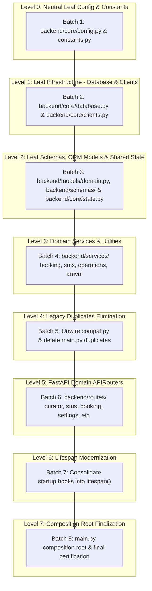

# Master Refactor Map & Whole-Repository Dependency Analysis

## Executive Summary

This document establishes the programmatic whole-repository AST and dependency analysis of `backend/main.py` 
executed in accordance with Phase 1 of the Master Refactor Brief (`Anti-Gravity_Strangler_Refactor_Brief.md`).

### Codebase & Symbol Inventory
- **File Analyzed:** `backend/main.py`
- **Total Lines of Code:** **16446**
- **Total Top-Level Functions:** **446**
  - Route Handler Functions: **116** (serving 117 route endpoints in `main.py`, plus 3 mounted via `anon_content_router` = 120 custom endpoints)
  - Fragmented Startup/Shutdown Hooks: **4**
  - Domain & Helper Functions: **326**
- **Total Top-Level Classes:** **71**
- **Total Module-Level Globals/Assignments:** **167**
- **Total Significant Symbols Tracked:** **675**

### Symbol Classification Breakdown (Section 7 Compliance)

| Classification | Count | Description / Role |
| :--- | :--- | :--- |
| `COMPOSITION` | 7 | Application wiring, lifespan, middleware, and router mounting |
| `CANONICAL IMPLEMENTATION` | 315 | Active business logic/schemas requiring extraction to domain services |
| `LEGACY DUPLICATE` | 73 | Duplicated implementations already superseded in `curator/`, `knowledge/`, etc. |
| `COMPATIBILITY SHIM` | 0 | Temporary bridges between legacy callers and modular code |
| `ROUTE` | 116 | FastAPI endpoints to migrate into domain `APIRouter` modules |
| `CONFIGURATION` | 66 | Static constants, environment parameters, and directory paths |
| `GLOBAL STATE` | 16 | Shared mutable state, DB engines/sessions, and API client instances |
| `DEAD CANDIDATE` | 81 | Symbols with no detected callers across backend or test suite |
| `DYNAMIC / UNCERTAIN` | 1 | Symbols accessed dynamically via `getattr` or `sys.modules['main']` |
| **TOTAL** | **675** | |

---

## 1. Tactical Refinement Analysis (Section 45 Safeguards)

### 1.1 Neutral Leaf Extraction Targets (Tactical Refinement 1)
To prevent circular import cascades (`ImportError: cannot import name ... from partially initialized module 'backend.main'`), 
all module-level shared state, DB engine/sessions, and API clients MUST be extracted to neutral leaves (`backend/core/`) 
before any domain router is extracted:

| Symbol | Category | Target Leaf Module | Notes |
| :--- | :--- | :--- | :--- |
| `AGENT_CONSOLE_ACTIVE_STATUSES` | `CONFIGURATION` | `backend/core/config.py` | Line 12839: Static configuration, directory path, or environment parameter |
| `AGENT_CONSOLE_CODING_SUBMISSION_RESERVED_SECONDS` | `CONFIGURATION` | `backend/core/config.py` | Line 12891: Static configuration, directory path, or environment parameter |
| `AGENT_CONSOLE_CONTEXT_LEGACY_RUN_LIMIT` | `CONFIGURATION` | `backend/core/config.py` | Line 12889: Static configuration, directory path, or environment parameter |
| `AGENT_CONSOLE_CONTEXT_MESSAGE_LIMIT` | `CONFIGURATION` | `backend/core/config.py` | Line 12888: Static configuration, directory path, or environment parameter |
| `AGENT_CONSOLE_HISTORY_DAYS` | `CONFIGURATION` | `backend/core/config.py` | Line 12884: Static configuration, directory path, or environment parameter |
| `AGENT_CONSOLE_HISTORY_LIMIT` | `CONFIGURATION` | `backend/core/config.py` | Line 12883: Static configuration, directory path, or environment parameter |
| `AGENT_CONSOLE_PROTOCOL_VERSION` | `CONFIGURATION` | `backend/core/config.py` | Line 12838: Static configuration, directory path, or environment parameter |
| `AGENT_CONSOLE_TERMINAL_STATUSES` | `CONFIGURATION` | `backend/core/config.py` | Line 12840: Static configuration, directory path, or environment parameter |
| `AGENT_CONSOLE_WORKSPACE_LIMIT_BYTES` | `CONFIGURATION` | `backend/core/config.py` | Line 12885: Static configuration, directory path, or environment parameter |
| `AGENT_RUNS_DIR` | `CONFIGURATION` | `backend/core/config.py` | Line 12882: Static configuration, directory path, or environment parameter |
| `AUDIT_SCHEMA_VERSION` | `CONFIGURATION` | `backend/core/config.py` | Line 706: Static configuration, directory path, or environment parameter |
| `AUTH_PASSWORD` | `CONFIGURATION` | `backend/core/config.py` | Line 4797: Static configuration, directory path, or environment parameter |
| `AUTH_SESSION_MAX_AGE` | `GLOBAL STATE` | `backend/core/database.py` | Line 4799: Database engine, session factory, or connection handle |
| `AUTH_USERNAME` | `CONFIGURATION` | `backend/core/config.py` | Line 4796: Static configuration, directory path, or environment parameter |
| `AUTO_REPLY_GLOBAL_ENABLED` | `CONFIGURATION` | `backend/core/config.py` | Line 4402: Static configuration, directory path, or environment parameter |
| `AVAILABILITY_CLAIM_RE` | `CONFIGURATION` | `backend/core/config.py` | Line 6330: Static configuration, directory path, or environment parameter |
| `AVAILABILITY_REPLY_POLICY` | `CONFIGURATION` | `backend/core/config.py` | Line 293: Static configuration, directory path, or environment parameter |
| `AVAILABILITY_REQUEST_RE` | `CONFIGURATION` | `backend/core/config.py` | Line 6324: Static configuration, directory path, or environment parameter |
| `BASE_DIR` | `CONFIGURATION` | `backend/core/config.py` | Line 12: Static configuration, directory path, or environment parameter |
| `BOOKING_REMINDER_CONFIG_PATH` | `CONFIGURATION` | `backend/core/config.py` | Line 15362: Static configuration, directory path, or environment parameter |
| `BOOKING_REMINDER_LOCK` | `CONFIGURATION` | `backend/core/config.py` | Line 15364: Static configuration, directory path, or environment parameter |
| `BOOKING_REMINDER_SENT_PATH` | `CONFIGURATION` | `backend/core/config.py` | Line 15363: Static configuration, directory path, or environment parameter |
| `BOOTCAMP_HANDOFF_RE` | `CONFIGURATION` | `backend/core/config.py` | Line 15984: Static configuration, directory path, or environment parameter |
| `BOOTCAMP_OPENINGS_FILE` | `CONFIGURATION` | `backend/core/config.py` | Line 289: Static configuration, directory path, or environment parameter |
| `BOOTCAMP_REFUSAL_RE` | `CONFIGURATION` | `backend/core/config.py` | Line 15988: Static configuration, directory path, or environment parameter |
| `BOOTCAMP_STORE` | `CONFIGURATION` | `backend/core/config.py` | Line 554: Static configuration, directory path, or environment parameter |
| `BUSINESS_VARIABLES_PATH` | `CONFIGURATION` | `backend/core/config.py` | Line 1578: Static configuration, directory path, or environment parameter |
| `CONVERSATIONAL_AI_ACCOUNT_KEYS` | `CONFIGURATION` | `backend/core/config.py` | Line 4443: Static configuration, directory path, or environment parameter |
| `DATABASE_URL` | `CONFIGURATION` | `backend/core/config.py` | Line 602: Static configuration, directory path, or environment parameter |
| `DATA_DIR` | `CONFIGURATION` | `backend/core/config.py` | Line 547: Static configuration, directory path, or environment parameter |
| `DEFAULT_BOOKING_REMINDER_TEMPLATE` | `CONFIGURATION` | `backend/core/config.py` | Line 15365: Static configuration, directory path, or environment parameter |
| `DEFAULT_CATCH_UP_LOOKBACK_DAYS` | `CONFIGURATION` | `backend/core/config.py` | Line 9816: Static configuration, directory path, or environment parameter |
| `DOTENV_AVAILABLE` | `CONFIGURATION` | `backend/core/config.py` | Line 94: Static configuration, directory path, or environment parameter |
| `FIRST_CONTACT_ACCOUNT_KEYS` | `CONFIGURATION` | `backend/core/config.py` | Line 4442: Static configuration, directory path, or environment parameter |
| `FIRST_CONTACT_AUTORESPONDER_DEFAULT` | `CONFIGURATION` | `backend/core/config.py` | Line 4435: Static configuration, directory path, or environment parameter |
| `FIRST_CONTACT_AUTORESPONDER_PATH` | `CONFIGURATION` | `backend/core/config.py` | Line 4434: Static configuration, directory path, or environment parameter |
| `INTERNAL_INSTRUCTION_REPLY_PATTERNS` | `CONFIGURATION` | `backend/core/config.py` | Line 5479: Static configuration, directory path, or environment parameter |
| `KNOWLEDGE_DIR` | `CONFIGURATION` | `backend/core/config.py` | Line 550: Static configuration, directory path, or environment parameter |
| `LEARNED_INFORMATION_LOCK` | `GLOBAL STATE` | `backend/core/state.py` | Line 1899: Shared in-memory data structure, lock, or cache |
| `LINE_PROFILES_PATH` | `CONFIGURATION` | `backend/core/config.py` | Line 1423: Static configuration, directory path, or environment parameter |
| `MANUAL_REPLY_DEDUPE_WINDOW` | `CONFIGURATION` | `backend/core/config.py` | Line 9469: Static configuration, directory path, or environment parameter |
| `MESSAGE_EXPORT_COLUMNS` | `CONFIGURATION` | `backend/core/config.py` | Line 14884: Static configuration, directory path, or environment parameter |
| `MESSAGE_UI_SETTINGS_PATH` | `CONFIGURATION` | `backend/core/config.py` | Line 9814: Static configuration, directory path, or environment parameter |
| `OPERATIONS_CODE_ACTIVE_STATUSES` | `CONFIGURATION` | `backend/core/config.py` | Line 11584: Static configuration, directory path, or environment parameter |
| `OPERATIONS_CODE_BLOCKED_NAMES` | `GLOBAL STATE` | `backend/core/state.py` | Line 11578: Shared in-memory data structure, lock, or cache |
| `OPERATIONS_CODE_BLOCKED_PARTS` | `GLOBAL STATE` | `backend/core/state.py` | Line 11574: Shared in-memory data structure, lock, or cache |
| `OPERATIONS_CODE_IMMUTABLE_PATHS` | `CONFIGURATION` | `backend/core/config.py` | Line 11585: Static configuration, directory path, or environment parameter |
| `OPERATIONS_CODE_SECRET_RE` | `CONFIGURATION` | `backend/core/config.py` | Line 11581: Static configuration, directory path, or environment parameter |
| `OPERATIONS_MEMORY_PRIVATE_RE` | `CONFIGURATION` | `backend/core/config.py` | Line 11469: Static configuration, directory path, or environment parameter |
| `OPERATIONS_VOICE_SHARED_TOOL_NAMES` | `CONFIGURATION` | `backend/core/config.py` | Line 10548: Static configuration, directory path, or environment parameter |
| `OPERATIONS_WORKER_PROTOCOL_VERSION` | `CONFIGURATION` | `backend/core/config.py` | Line 11588: Static configuration, directory path, or environment parameter |
| `OPERATIONS_WORKER_WORKFLOW_PATH` | `CONFIGURATION` | `backend/core/config.py` | Line 11587: Static configuration, directory path, or environment parameter |
| `OUTBOUND_SMS_SEND_LOCK` | `GLOBAL STATE` | `backend/core/state.py` | Line 9468: Shared in-memory data structure, lock, or cache |
| `OUTGOING_URL_RE` | `CONFIGURATION` | `backend/core/config.py` | Line 189: Static configuration, directory path, or environment parameter |
| `PERSIST_DIR` | `CONFIGURATION` | `backend/core/config.py` | Line 545: Static configuration, directory path, or environment parameter |
| `PORTAL_SPA_PATHS` | `CONFIGURATION` | `backend/core/config.py` | Line 4774: Static configuration, directory path, or environment parameter |
| `PROMPTS_DIR` | `CONFIGURATION` | `backend/core/config.py` | Line 556: Static configuration, directory path, or environment parameter |
| `PUBLIC_EXACT_PATHS` | `CONFIGURATION` | `backend/core/config.py` | Line 4800: Static configuration, directory path, or environment parameter |
| `QUICK_REPLIES_PATH` | `CONFIGURATION` | `backend/core/config.py` | Line 9815: Static configuration, directory path, or environment parameter |
| `QUICK_REPLY_ACCOUNT_KEYS` | `CONFIGURATION` | `backend/core/config.py` | Line 9817: Static configuration, directory path, or environment parameter |
| `QUICK_REPLY_DEFAULT_LABELS` | `CONFIGURATION` | `backend/core/config.py` | Line 9818: Static configuration, directory path, or environment parameter |
| `RELEVANCE_AND_THREAD_FLOW_POLICY` | `CONFIGURATION` | `backend/core/config.py` | Line 321: Static configuration, directory path, or environment parameter |
| `RETRIEVED_BUSINESS_CONTEXT_POLICY` | `CONFIGURATION` | `backend/core/config.py` | Line 311: Static configuration, directory path, or environment parameter |
| `SMS_REPLY_THREAD_LOCKS` | `CONFIGURATION` | `backend/core/config.py` | Line 8612: Static configuration, directory path, or environment parameter |
| `STYLE_PROFILE_STORE` | `CONFIGURATION` | `backend/core/config.py` | Line 553: Static configuration, directory path, or environment parameter |
| `SessionLocal` | `GLOBAL STATE` | `backend/core/database.py` | Line 611: Database engine, session factory, or connection handle |
| `TAKEOVER_RELEASE_EVENT_TYPES` | `CONFIGURATION` | `backend/core/config.py` | Line 7520: Static configuration, directory path, or environment parameter |
| `TMP_DIR` | `CONFIGURATION` | `backend/core/config.py` | Line 13: Static configuration, directory path, or environment parameter |
| `UNSAFE_HOLDING_REPLY_PATTERNS` | `CONFIGURATION` | `backend/core/config.py` | Line 5470: Static configuration, directory path, or environment parameter |
| `URL_TRAILING_PUNCTUATION_RE` | `CONFIGURATION` | `backend/core/config.py` | Line 186: Static configuration, directory path, or environment parameter |
| `WORKING_HOURS_PATH` | `CONFIGURATION` | `backend/core/config.py` | Line 6176: Static configuration, directory path, or environment parameter |
| `_agent_event_lock` | `GLOBAL STATE` | `backend/core/state.py` | Line 12893: Shared in-memory data structure, lock, or cache |
| `_agent_start_lock` | `GLOBAL STATE` | `backend/core/state.py` | Line 12892: Shared in-memory data structure, lock, or cache |
| `_operations_code_deployment_lock` | `GLOBAL STATE` | `backend/core/state.py` | Line 11590: Shared in-memory data structure, lock, or cache |
| `_operations_code_task_lock` | `GLOBAL STATE` | `backend/core/state.py` | Line 11589: Shared in-memory data structure, lock, or cache |
| `_quick_replies_lock` | `GLOBAL STATE` | `backend/core/state.py` | Line 9819: Shared in-memory data structure, lock, or cache |
| `_vapid_key_lock` | `GLOBAL STATE` | `backend/core/state.py` | Line 8032: Shared in-memory data structure, lock, or cache |
| `calendar_service` | `GLOBAL STATE` | `backend/core/clients.py` | Line 4385: External service API client instance |
| `engine` | `GLOBAL STATE` | `backend/core/database.py` | Line 610: Database engine, session factory, or connection handle |
| `openai_client` | `GLOBAL STATE` | `backend/core/clients.py` | Line 4391: External service API client instance |
| `operations_github_client` | `GLOBAL STATE` | `backend/core/clients.py` | Line 184: External service API client instance |
| `port` | `CONFIGURATION` | `backend/core/config.py` | Line 16440: Static configuration, directory path, or environment parameter |

### 1.2 Fragmented Startup Hooks to Modern Lifespan (Tactical Refinement 2)
The following 4 startup hooks currently run as fragmented `@app.on_event('startup')` handlers emitting deprecation warnings.
These must be consolidated into a single `asynccontextmanager` `lifespan(app: FastAPI)` handler in `backend/main.py`:

| Handler Name | Line | Hook Decorator | Responsibility / Tasks Managed |
| :--- | :--- | :--- | :--- |
| `start_arrival_alert_worker` | L8294 | `app.on_event('startup')` | Database seed, background workers, or cache warmup |
| `recover_interrupted_agent_console_runs` | L13293 | `app.on_event('startup')` | Never leave a volatile orchestration marked as live after a process restart. |
| `start_agent_console_retention_worker` | L13319 | `app.on_event('startup')` | Database seed, background workers, or cache warmup |
| `start_booking_reminder_worker` | L15501 | `app.on_event('startup')` | Database seed, background workers, or cache warmup |

### 1.3 `sys.modules['main']` Dynamic Access Sites
The Master Brief specifies zero runtime production dependencies on `sys.modules['main']` upon refactor completion.
The following call sites in active repository code actively query `sys.modules` or reflectively access `main`:

| Calling File | Line | Type | Code Snippet | Target Remediation |
| :--- | :--- | :--- | :--- | :--- |
| `backend/config/timezone.py` | L86 | `getattr(LINE_PROFILES_PATH)` | `return getattr(mod, "LINE_PROFILES_PATH")` | Migrate to backend/core/config.py |
| `backend/config/timezone.py` | L187 | `getattr(LINE_PROFILE_DEFAULTS)` | `defaults = getattr(mod, "LINE_PROFILE_DEFAULTS")` | Migrate to backend/core/config.py |
| `backend/curator/compat.py` | L12 | `sys.modules` | `main_mod = sys.modules.get("__main__")` | Eliminate compat bridge via Batch 5 |
| `backend/curator/compat.py` | L14 | `sys.modules` | `return sys.modules["__main__"]` | Eliminate compat bridge via Batch 5 |
| `backend/curator/compat.py` | L15 | `sys.modules` | `mod = sys.modules.get("main") or sys.modules.get("backend.main")` | Eliminate compat bridge via Batch 5 |

### 1.4 Downstream Module Imports of `backend.main`
The following active production and test modules currently import directly from `backend.main` or `main`:

| Module File | Line | Import Statement | Imported Symbols |
| :--- | :--- | :--- | :--- |
| `backend/curator/compat.py` | L18 | `import backend.main as mod` | `<module>` |
| `backend/curator/compat.py` | L21 | `import main as mod` | `<module>` |
| `backend/run_offline_evaluation.py` | L10 | `from main import CANONICAL_INTENT_TAXONOMY, DATASET_FILE, SMSExampleIndex, classify_query_intent, tokenise, get_business_variable_values` | `CANONICAL_INTENT_TAXONOMY`, `DATASET_FILE`, `SMSExampleIndex`, `classify_query_intent`, `tokenise`, `get_business_variable_values` |
| `backend/test_admin_auth_shell.py` | L3 | `import main` | `<module>` |
| `backend/test_agent_console.py` | L14 | `import main` | `<module>` |
| `backend/test_arrival_chat.py` | L8 | `import main` | `<module>` |
| `backend/test_arrival_chat.py` | L9 | `from main import ArrivalChatMessage, ArrivalSession, CalendarEvent, Message, SessionLocal, Thread, ThreadEvent, app` | `ArrivalChatMessage`, `ArrivalSession`, `CalendarEvent`, `Message`, `SessionLocal`, `Thread`, `ThreadEvent`, `app` |
| `backend/test_arrival_migration.py` | L6 | `import main` | `<module>` |
| `backend/test_backend.py` | L16 | `import main` | `<module>` |
| `backend/test_backend.py` | L17 | `from main import app, engine, Base, Thread, Message, Note, ThreadEvent, SessionLocal` | `app`, `engine`, `Base`, `Thread`, `Message`, `Note`, `ThreadEvent`, `SessionLocal` |
| `backend/test_backend.py` | L344 | `from main import search_knowledge, KNOWLEDGE_CHUNKS` | `search_knowledge`, `KNOWLEDGE_CHUNKS` |
| `backend/test_booking_alert_feed.py` | L6 | `import main` | `<module>` |
| `backend/test_booking_boundary_rollback.py` | L9 | `import main` | `<module>` |
| `backend/test_booking_boundary_rollback.py` | L10 | `from main import Base, Message, Thread, ThreadEvent` | `Base`, `Message`, `Thread`, `ThreadEvent` |
| `backend/test_booking_conversation_boundaries.py` | L7 | `import main` | `<module>` |
| `backend/test_booking_conversation_boundaries.py` | L8 | `from main import Base, Message, Thread` | `Base`, `Message`, `Thread` |
| `backend/test_booking_timezone.py` | L1 | `from main import parse_business_datetime` | `parse_business_datetime` |
| `backend/test_bootcamp_information_request.py` | L1 | `import main` | `<module>` |
| `backend/test_bootcamp_information_request.py` | L3 | `from main import BootcampInformationRequestInput, respond_to_bootcamp_information_request` | `BootcampInformationRequestInput`, `respond_to_bootcamp_information_request` |
| `backend/test_bootcamp_real.py` | L8 | `import main` | `<module>` |
| `backend/test_business_variables.py` | L6 | `import main` | `<module>` |
| `backend/test_catch_up.py` | L7 | `import main` | `<module>` |
| `backend/test_catch_up.py` | L8 | `from main import Base, Message, Thread, ThreadEvent, WebhookSMSInput, catch_up_missed_messages, find_oldest_catch_up_candidate` | `Base`, `Message`, `Thread`, `ThreadEvent`, `WebhookSMSInput`, `catch_up_missed_messages`, `find_oldest_catch_up_candidate` |
| `backend/test_conversation_safety.py` | L8 | `import main` | `<module>` |
| `backend/test_conversation_safety.py` | L9 | `from main import Base, CalendarEvent, Message, ReplyInput, Thread, ThreadEvent` | `Base`, `CalendarEvent`, `Message`, `ReplyInput`, `Thread`, `ThreadEvent` |
| `backend/test_conversational_booking.py` | L9 | `import main` | `<module>` |
| `backend/test_conversational_booking.py` | L11 | `from main import Base, Message, Thread, booking_availability_error, asks_for_secondary_booking_confirmation, confirm_conversational_booking, current_business_time, is_explicit_booking_confirmation, is_explicit_booking_rejection, propose_conversational_booking, run_sms_reply_logic, validate_availability_claim` | `Base`, `Message`, `Thread`, `booking_availability_error`, `asks_for_secondary_booking_confirmation`, `confirm_conversational_booking`, `current_business_time`, `is_explicit_booking_confirmation`, `is_explicit_booking_rejection`, `propose_conversational_booking`, `run_sms_reply_logic`, `validate_availability_claim` |
| `backend/test_customer_arrival.py` | L8 | `from main import Base, Message, Thread, ThreadEvent, get_threads, is_clear_customer_arrival, record_customer_arrival_event` | `Base`, `Message`, `Thread`, `ThreadEvent`, `get_threads`, `is_clear_customer_arrival`, `record_customer_arrival_event` |
| `backend/test_dataset_validation.py` | L10 | `from main import CANONICAL_INTENT_TAXONOMY, DATASET_FILE` | `CANONICAL_INTENT_TAXONOMY`, `DATASET_FILE` |
| `backend/test_inbound_webhook_reliability.py` | L9 | `import main` | `<module>` |
| `backend/test_inbound_webhook_reliability.py` | L10 | `from main import Base, InboundWebhookReceipt, Message, WebhookSMSInput, inbound_webhook_identity, webhook_sms` | `Base`, `InboundWebhookReceipt`, `Message`, `WebhookSMSInput`, `inbound_webhook_identity`, `webhook_sms` |
| `backend/test_information_request.py` | L7 | `import main` | `<module>` |
| `backend/test_information_request.py` | L8 | `from main import Base, InformationRequestResponseInput, Message, Thread, ThreadEvent, respond_to_information_request` | `Base`, `InformationRequestResponseInput`, `Message`, `Thread`, `ThreadEvent`, `respond_to_information_request` |
| `backend/test_intent_retrieval.py` | L8 | `from main import SMSExampleIndex, DATASET_FILE, CANONICAL_INTENT_TAXONOMY, classify_query_intent, get_style_examples` | `SMSExampleIndex`, `DATASET_FILE`, `CANONICAL_INTENT_TAXONOMY`, `classify_query_intent`, `get_style_examples` |
| `backend/test_knowledge_curator.py` | L8 | `import main` | `<module>` |
| `backend/test_knowledge_hygiene_guardrails.py` | L4 | `import main` | `<module>` |
| `backend/test_knowledge_integrity.py` | L5 | `import main` | `<module>` |
| `backend/test_knowledge_line_scoping.py` | L3 | `import main` | `<module>` |
| `backend/test_learned_rule_manager.py` | L3 | `import main` | `<module>` |
| `backend/test_manual_reply_idempotency.py` | L6 | `import main` | `<module>` |
| `backend/test_manual_reply_idempotency.py` | L7 | `from main import Base, Message, ReplyInput, Thread` | `Base`, `Message`, `ReplyInput`, `Thread` |
| `backend/test_message_csv_export.py` | L11 | `import main` | `<module>` |
| `backend/test_mobilemessage_service.py` | L7 | `import main` | `<module>` |
| `backend/test_no_simulated_replies.py` | L8 | `import main` | `<module>` |
| `backend/test_no_simulated_replies.py` | L9 | `from main import Base, Message, Thread, ThreadEvent, run_sms_reply_logic` | `Base`, `Message`, `Thread`, `ThreadEvent`, `run_sms_reply_logic` |
| `backend/test_operations_ai_chat.py` | L9 | `import main` | `<module>` |
| `backend/test_operations_ai_chat.py` | L10 | `from main import Base, Message, OperationsChatInput, OperationsChatMessage, OperationsMemory, Thread, ThreadEvent` | `Base`, `Message`, `OperationsChatInput`, `OperationsChatMessage`, `OperationsMemory`, `Thread`, `ThreadEvent` |
| `backend/test_operations_github_service.py` | L162 | `import main` | `<module>` |
| `backend/test_phase7_ui_visibility.py` | L7 | `import main` | `<module>` |
| `backend/test_phase7_ui_visibility.py` | L8 | `from main import app` | `app` |
| `backend/test_phone_threads.py` | L3 | `import main` | `<module>` |
| `backend/test_phone_threads.py` | L8 | `from main import ArrivalSession, Base, BlockedContact, CalendarEvent, Message, Thread, canonical_phone_number, find_thread_by_phone, get_thread_detail, get_threads, is_contact_blocked, list_blocked_contacts, list_catch_up_candidates, set_thread_blocked, set_thread_pinned, unblock_contact, ThreadBlockedInput, ThreadPinnedInput, WebhookSMSInput, process_inbound_sms` | `ArrivalSession`, `Base`, `BlockedContact`, `CalendarEvent`, `Message`, `Thread`, `canonical_phone_number`, `find_thread_by_phone`, `get_thread_detail`, `get_threads`, `is_contact_blocked`, `list_blocked_contacts`, `list_catch_up_candidates`, `set_thread_blocked`, `set_thread_pinned`, `unblock_contact`, `ThreadBlockedInput`, `ThreadPinnedInput`, `WebhookSMSInput`, `process_inbound_sms` |
| `backend/test_prompt_assembly.py` | L9 | `import main` | `<module>` |
| `backend/test_prompt_assembly.py` | L10 | `from main import assemble_safe_prompt, build_model_instructions, build_model_input, get_style_examples, render_style_examples, classify_query_intent, SMSExampleIndex, DATASET_FILE, validate_no_unresolved_placeholders, get_business_variable_values` | `assemble_safe_prompt`, `build_model_instructions`, `build_model_input`, `get_style_examples`, `render_style_examples`, `classify_query_intent`, `SMSExampleIndex`, `DATASET_FILE`, `validate_no_unresolved_placeholders`, `get_business_variable_values` |
| `backend/test_prompting.py` | L8 | `from main import AVAILABILITY_REPLY_POLICY, SMSExampleIndex, get_live_services_context, build_model_input, build_model_instructions, build_read_only_calendar_context, get_style_examples, should_process_sms_synchronously, sanitize_outgoing_urls, build_broad_availability_guidance, current_business_time, run_sms_reply_logic, suppress_recently_sent_links, suppress_unrequested_payment_details` | `AVAILABILITY_REPLY_POLICY`, `SMSExampleIndex`, `get_live_services_context`, `build_model_input`, `build_model_instructions`, `build_read_only_calendar_context`, `get_style_examples`, `should_process_sms_synchronously`, `sanitize_outgoing_urls`, `build_broad_availability_guidance`, `current_business_time`, `run_sms_reply_logic`, `suppress_recently_sent_links`, `suppress_unrequested_payment_details` |
| `backend/test_public_booking_embed.py` | L3 | `from main import is_public_request` | `is_public_request` |
| `backend/test_push_notifications.py` | L6 | `import main` | `<module>` |
| `backend/test_push_notifications.py` | L7 | `from main import ArrivalSession, CalendarEvent, PushSubscription, SessionLocal, Thread, app` | `ArrivalSession`, `CalendarEvent`, `PushSubscription`, `SessionLocal`, `Thread`, `app` |
| `backend/test_rag_architecture.py` | L8 | `from main import SMSExampleIndex, DATASET_FILE, CANONICAL_INTENT_TAXONOMY, get_style_examples, classify_query_intent, app` | `SMSExampleIndex`, `DATASET_FILE`, `CANONICAL_INTENT_TAXONOMY`, `get_style_examples`, `classify_query_intent`, `app` |
| `backend/test_rag_architecture.py` | L181 | `import main` | `<module>` |
| `backend/test_rag_architecture.py` | L234 | `import main` | `<module>` |
| `backend/test_retrieval_ambiguity.py` | L8 | `from main import SMSExampleIndex, DATASET_FILE, CANONICAL_INTENT_TAXONOMY, classify_query_intent, get_style_examples` | `SMSExampleIndex`, `DATASET_FILE`, `CANONICAL_INTENT_TAXONOMY`, `classify_query_intent`, `get_style_examples` |
| `backend/test_route_parity.py` | L74 | `from backend.main import app` | `app` |
| `backend/test_services.py` | L13 | `import main` | `<module>` |
| `backend/test_services.py` | L14 | `from main import app, engine, Base, DATA_DIR, PROMPTS_DIR` | `app`, `engine`, `Base`, `DATA_DIR`, `PROMPTS_DIR` |
| `backend/test_settings_and_drafts.py` | L8 | `import main` | `<module>` |
| `backend/test_settings_and_drafts.py` | L9 | `from main import Base, Message, SettingsUpdateInput, Thread, ThreadEvent, find_oldest_catch_up_candidate` | `Base`, `Message`, `SettingsUpdateInput`, `Thread`, `ThreadEvent`, `find_oldest_catch_up_candidate` |
| `backend/test_shared_message_visibility.py` | L7 | `import main` | `<module>` |
| `backend/test_shared_message_visibility.py` | L8 | `from main import Base, Message, ReplyInput, Thread, get_thread_detail, get_threads, reply_thread` | `Base`, `Message`, `ReplyInput`, `Thread`, `get_thread_detail`, `get_threads`, `reply_thread` |
| `backend/test_sms_simulator.py` | L8 | `import main` | `<module>` |
| `backend/test_timestamp_aware_replies.py` | L7 | `import main` | `<module>` |
| `backend/test_timestamp_aware_replies.py` | L8 | `from main import Base, Message, Thread` | `Base`, `Message`, `Thread` |
| `backend/test_ui_availability.py` | L3 | `import main` | `<module>` |
| `backend/test_variable_architecture.py` | L7 | `import main` | `<module>` |
| `scripts/snapshot_routes.py` | L80 | `from backend.main import app` | `app` |

---

## 2. Identified Legacy Duplicates & Canonical Equivalents (Section 9)

The following legacy implementations inside `main.py` are duplicated by authoritative canonical modules 
in `backend/curator/`, `backend/knowledge/`, `backend/config/`, or `backend/observability/`. 
In accordance with Section 9, callers must be redirected to the canonical version and these legacy duplicates deleted:

| Legacy Symbol in `main.py` | Line | Canonical Implementation | Modular Target File | Risk Level |
| :--- | :--- | :--- | :--- | :--- |
| `Base` | L612 | `backend.knowledge.models.Base` | `backend/knowledge/models.py` | MEDIUM (Verify identical signature and behavior) |
| `KNOWLEDGE_CATEGORIES` | L2388 | `backend.curator.classifier.KNOWLEDGE_CATEGORIES` | `backend/curator/classifier.py` | MEDIUM (Verify identical signature and behavior) |
| `KNOWLEDGE_CLASSIFICATION_VERSION` | L2386 | `backend.curator.classifier.KNOWLEDGE_CLASSIFICATION_VERSION` | `backend/curator/classifier.py` | MEDIUM (Verify identical signature and behavior) |
| `KNOWLEDGE_CURATOR_ACTIONS` | L2704 | `backend.curator.service.KNOWLEDGE_CURATOR_ACTIONS` | `backend/curator/service.py` | MEDIUM (Verify identical signature and behavior) |
| `KNOWLEDGE_CURATOR_CONTEXTUAL_SOURCE_MARKERS` | L2718 | `backend.curator.service.KNOWLEDGE_CURATOR_CONTEXTUAL_SOURCE_MARKERS` | `backend/curator/service.py` | MEDIUM (Verify identical signature and behavior) |
| `KNOWLEDGE_CURATOR_FINDING_TYPES` | L2688 | `backend.curator.service.KNOWLEDGE_CURATOR_FINDING_TYPES` | `backend/curator/service.py` | MEDIUM (Verify identical signature and behavior) |
| `KNOWLEDGE_CURATOR_LOCK` | L2680 | `backend.curator.service.KNOWLEDGE_CURATOR_LOCK` | `backend/curator/service.py` | MEDIUM (Verify identical signature and behavior) |
| `KNOWLEDGE_CURATOR_MALFORMED_REFERENCE_REASONS` | L2865 | `backend.curator.service.KNOWLEDGE_CURATOR_MALFORMED_REFERENCE_REASONS` | `backend/curator/service.py` | MEDIUM (Verify identical signature and behavior) |
| `KNOWLEDGE_CURATOR_MAX_BACKUPS` | L2684 | `backend.curator.service.KNOWLEDGE_CURATOR_MAX_BACKUPS` | `backend/curator/service.py` | MEDIUM (Verify identical signature and behavior) |
| `KNOWLEDGE_CURATOR_MAX_MAINTENANCE_AUDITS` | L2683 | `backend.curator.service.KNOWLEDGE_CURATOR_MAX_MAINTENANCE_AUDITS` | `backend/curator/service.py` | MEDIUM (Verify identical signature and behavior) |
| `KNOWLEDGE_CURATOR_MAX_PROPOSALS` | L2682 | `backend.curator.service.KNOWLEDGE_CURATOR_MAX_PROPOSALS` | `backend/curator/service.py` | MEDIUM (Verify identical signature and behavior) |
| `KNOWLEDGE_CURATOR_MAX_RUNS` | L2681 | `backend.curator.service.KNOWLEDGE_CURATOR_MAX_RUNS` | `backend/curator/service.py` | MEDIUM (Verify identical signature and behavior) |
| `KNOWLEDGE_CURATOR_MODEL` | L2687 | `backend.curator.service.KNOWLEDGE_CURATOR_MODEL` | `backend/curator/service.py` | MEDIUM (Verify identical signature and behavior) |
| `KNOWLEDGE_CURATOR_RESOLUTIONS` | L2713 | `backend.curator.service.KNOWLEDGE_CURATOR_RESOLUTIONS` | `backend/curator/service.py` | MEDIUM (Verify identical signature and behavior) |
| `KNOWLEDGE_CURATOR_STATE_PATH` | L2679 | `backend.curator.service.KNOWLEDGE_CURATOR_STATE_PATH` | `backend/curator/service.py` | MEDIUM (Verify identical signature and behavior) |
| `KNOWLEDGE_CURATOR_UNRESOLVED_STATUSES` | L2712 | `backend.curator.service.KNOWLEDGE_CURATOR_UNRESOLVED_STATUSES` | `backend/curator/service.py` | MEDIUM (Verify identical signature and behavior) |
| `KNOWLEDGE_SCOPES` | L2387 | `backend.curator.classifier.KNOWLEDGE_SCOPES` | `backend/curator/classifier.py` | MEDIUM (Verify identical signature and behavior) |
| `_approve_curator_supersession_entry` | L3760 | `backend.curator.supersession._approve_curator_supersession_entry` | `backend/curator/supersession.py` | MEDIUM (Verify identical signature and behavior) |
| `_bound_curator_proposals` | L2752 | `backend.curator.service._bound_curator_proposals` | `backend/curator/service.py` | MEDIUM (Verify identical signature and behavior) |
| `_classify_curator_model_failure` | L3472 | `backend.curator.service._classify_curator_model_failure` | `backend/curator/service.py` | MEDIUM (Verify identical signature and behavior) |
| `_curator_applicability_key` | L3060 | `backend.curator.service._curator_applicability_key` | `backend/curator/service.py` | MEDIUM (Verify identical signature and behavior) |
| `_curator_authority_role` | L3050 | `backend.curator.service._curator_authority_role` | `backend/curator/service.py` | MEDIUM (Verify identical signature and behavior) |
| `_curator_authority_snapshot` | L3120 | `backend.curator.supersession._curator_authority_snapshot` | `backend/curator/supersession.py` | MEDIUM (Verify identical signature and behavior) |
| `_curator_backup_directory` | L3192 | `backend.curator.supersession._curator_backup_directory` | `backend/curator/supersession.py` | MEDIUM (Verify identical signature and behavior) |
| `_curator_bound_backups` | L3196 | `backend.curator.supersession._curator_bound_backups` | `backend/curator/supersession.py` | MEDIUM (Verify identical signature and behavior) |
| `_curator_dynamic_claim_detail` | L3023 | `backend.curator.sanitizer._curator_dynamic_claim_detail` | `backend/curator/sanitizer.py` | MEDIUM (Verify identical signature and behavior) |
| `_curator_dynamic_claim_kind` | L3045 | `backend.curator.sanitizer._curator_dynamic_claim_kind` | `backend/curator/sanitizer.py` | MEDIUM (Verify identical signature and behavior) |
| `_curator_effective_record_snapshot` | L3104 | `backend.curator.supersession._curator_effective_record_snapshot` | `backend/curator/supersession.py` | MEDIUM (Verify identical signature and behavior) |
| `_curator_empty_state` | L2748 | `backend.curator.service._curator_empty_state` | `backend/curator/service.py` | MEDIUM (Verify identical signature and behavior) |
| `_curator_enrich_proposals` | L3503 | `backend.curator.service._curator_enrich_proposals` | `backend/curator/service.py` | MEDIUM (Verify identical signature and behavior) |
| `_curator_finding` | L3280 | `backend.curator.service._curator_finding` | `backend/curator/service.py` | MEDIUM (Verify identical signature and behavior) |
| `_curator_has_authority_collision` | L3141 | `backend.curator.supersession._curator_has_authority_collision` | `backend/curator/supersession.py` | MEDIUM (Verify identical signature and behavior) |
| `_curator_invalid_metadata_fields` | L3065 | `backend.curator.service._curator_invalid_metadata_fields` | `backend/curator/service.py` | MEDIUM (Verify identical signature and behavior) |
| `_curator_legacy_timestamp` | L3132 | `backend.curator.supersession._curator_legacy_timestamp` | `backend/curator/supersession.py` | MEDIUM (Verify identical signature and behavior) |
| `_curator_metadata_repair_candidate` | L3157 | `backend.curator.supersession._curator_metadata_repair_candidate` | `backend/curator/supersession.py` | MEDIUM (Verify identical signature and behavior) |
| `_curator_owner_model_message` | L3490 | `backend.curator.service._curator_owner_model_message` | `backend/curator/service.py` | MEDIUM (Verify identical signature and behavior) |
| `_curator_proposal_is_current` | L3638 | `backend.curator.service._curator_proposal_is_current` | `backend/curator/service.py` | MEDIUM (Verify identical signature and behavior) |
| `_curator_record_preview` | L2924 | `backend.curator.service._curator_record_preview` | `backend/curator/service.py` | MEDIUM (Verify identical signature and behavior) |
| `_curator_records` | L3007 | `backend.curator.service._curator_records` | `backend/curator/service.py` | MEDIUM (Verify identical signature and behavior) |
| `_curator_reference_status_preview` | L2968 | `backend.curator.service._curator_reference_status_preview` | `backend/curator/service.py` | MEDIUM (Verify identical signature and behavior) |
| `_curator_reference_statuses` | L2943 | `backend.curator.service._curator_reference_statuses` | `backend/curator/service.py` | MEDIUM (Verify identical signature and behavior) |
| `_curator_safe_maintenance_entry` | L2807 | `backend.curator.service._curator_safe_maintenance_entry` | `backend/curator/service.py` | MEDIUM (Verify identical signature and behavior) |
| `_curator_safe_malformed_references` | L2892 | `backend.curator.service._curator_safe_malformed_references` | `backend/curator/service.py` | MEDIUM (Verify identical signature and behavior) |
| `_curator_safe_state_proposal` | L2831 | `backend.curator.service._curator_safe_state_proposal` | `backend/curator/service.py` | MEDIUM (Verify identical signature and behavior) |
| `_curator_safe_state_run` | L2784 | `backend.curator.service._curator_safe_state_run` | `backend/curator/service.py` | MEDIUM (Verify identical signature and behavior) |
| `_curator_sanitize_record_references` | L2870 | `backend.curator.service._curator_sanitize_record_references` | `backend/curator/service.py` | MEDIUM (Verify identical signature and behavior) |
| `_curator_source_role` | L3057 | `backend.curator.service._curator_source_role` | `backend/curator/service.py` | MEDIUM (Verify identical signature and behavior) |
| `_curator_valid_revision` | L3097 | `backend.curator.service._curator_valid_revision` | `backend/curator/service.py` | MEDIUM (Verify identical signature and behavior) |
| `_knowledge_meaning_signature` | L2219 | `backend.curator.classifier._knowledge_meaning_signature` | `backend/curator/classifier.py` | MEDIUM (Verify identical signature and behavior) |
| `_learning_other_provider_detail` | L2140 | `backend.curator.sanitizer._learning_other_provider_detail` | `backend/curator/sanitizer.py` | MEDIUM (Verify identical signature and behavior) |
| `_load_curator_state` | L2760 | `backend.curator.service._load_curator_state` | `backend/curator/service.py` | MEDIUM (Verify identical signature and behavior) |
| `_openai_error_code` | L2721 | `backend.curator.service._openai_error_code` | `backend/curator/service.py` | MEDIUM (Verify identical signature and behavior) |
| `_parse_json_object` | L1902 | `backend.curator.service._parse_json_object` | `backend/curator/service.py` | MEDIUM (Verify identical signature and behavior) |
| `_present_curator_proposal` | L2977 | `backend.curator.service._present_curator_proposal` | `backend/curator/service.py` | MEDIUM (Verify identical signature and behavior) |
| `_present_curator_state` | L2999 | `backend.curator.service._present_curator_state` | `backend/curator/service.py` | MEDIUM (Verify identical signature and behavior) |
| `_quarantined_knowledge_classification` | L2397 | `backend.curator.classifier._quarantined_knowledge_classification` | `backend/curator/classifier.py` | MEDIUM (Verify identical signature and behavior) |
| `_repair_legacy_knowledge_metadata` | L3202 | `backend.curator.supersession._repair_legacy_knowledge_metadata` | `backend/curator/supersession.py` | MEDIUM (Verify identical signature and behavior) |
| `_save_curator_state` | L2910 | `backend.curator.service._save_curator_state` | `backend/curator/service.py` | MEDIUM (Verify identical signature and behavior) |
| `accept_knowledge_curator_proposal` | L3661 | `backend.curator.service.accept_knowledge_curator_proposal` | `backend/curator/service.py` | MEDIUM (Verify identical signature and behavior) |
| `classify_all_learned_information` | L2471 | `backend.curator.classifier.classify_all_learned_information` | `backend/curator/classifier.py` | MEDIUM (Verify identical signature and behavior) |
| `classify_knowledge_candidate` | L2231 | `backend.curator.classifier.classify_knowledge_candidate` | `backend/curator/classifier.py` | MEDIUM (Verify identical signature and behavior) |
| `classify_knowledge_entries` | L2408 | `backend.curator.classifier.classify_knowledge_entries` | `backend/curator/classifier.py` | MEDIUM (Verify identical signature and behavior) |
| `get_knowledge_curator_state` | L3632 | `backend.curator.service.get_knowledge_curator_state` | `backend/curator/service.py` | MEDIUM (Verify identical signature and behavior) |
| `has_unsafe_literal_learning_detail` | L2117 | `backend.curator.sanitizer.has_unsafe_literal_learning_detail` | `backend/curator/sanitizer.py` | MEDIUM (Verify identical signature and behavior) |
| `inspect_knowledge_integrity` | L3325 | `backend.curator.service.inspect_knowledge_integrity` | `backend/curator/service.py` | MEDIUM (Verify identical signature and behavior) |
| `is_openai_quota_exhausted` | L2739 | `backend.curator.service.is_openai_quota_exhausted` | `backend/curator/service.py` | MEDIUM (Verify identical signature and behavior) |
| `logger` | L86 | `backend.knowledge.migration.logger` | `backend/knowledge/migration.py` | MEDIUM (Verify identical signature and behavior) |
| `prepare_learning_candidate` | L2262 | `backend.curator.classifier.prepare_learning_candidate` | `backend/curator/classifier.py` | MEDIUM (Verify identical signature and behavior) |
| `resolve_knowledge_curator_proposal` | L3666 | `backend.curator.service.resolve_knowledge_curator_proposal` | `backend/curator/service.py` | MEDIUM (Verify identical signature and behavior) |
| `run_knowledge_curator` | L3565 | `backend.curator.service.run_knowledge_curator` | `backend/curator/service.py` | MEDIUM (Verify identical signature and behavior) |
| `sanitise_reusable_knowledge_template` | L2166 | `backend.curator.sanitizer.sanitise_reusable_knowledge_template` | `backend/curator/sanitizer.py` | MEDIUM (Verify identical signature and behavior) |
| `shared_knowledge_is_generic` | L2157 | `backend.curator.sanitizer.shared_knowledge_is_generic` | `backend/curator/sanitizer.py` | MEDIUM (Verify identical signature and behavior) |
| `transition_knowledge_curator_proposal` | L3643 | `backend.curator.service.transition_knowledge_curator_proposal` | `backend/curator/service.py` | MEDIUM (Verify identical signature and behavior) |

---

## 3. FastAPI Route Handlers & Target APIRouter Allocation

The 120 custom API/WebSocket routes (116 handler functions in `main.py` serving 117 endpoints, plus 3 endpoints from `anon_content_router`) 
are partitioned into domain-specific routers to be extracted under `backend/routes/`:

| Endpoint Function | Method / Path | Target Router | Line |
| :--- | :--- | :--- | :--- |
| `accept_knowledge_curator_proposal_endpoint` | `POST /api/settings/knowledge-curator/proposals/{proposal_id}/accept` | `backend/routes/curator.py` | L15053 |
| `acknowledge_thread_arrival` | `POST /api/threads/{thread_id}/arrivals/{session_id}/acknowledge` | `backend/routes/arrival.py` | L9369 |
| `activate_arrival` | `POST /api/arrival/activate` | `backend/routes/arrival.py` | L8419 |
| `add_thread_note` | `POST /api/threads/{thread_id}/notes` | `backend/routes/phone.py` | L9682 |
| `admin_auth_login` | `POST /api/auth/login` | `backend/routes/auth.py` | L4965 |
| `admin_auth_logout` | `POST /api/auth/logout` | `backend/routes/auth.py` | L4973 |
| `admin_auth_status` | `GET /api/auth/status` | `backend/routes/auth.py` | L4958 |
| `apply_bootcamp_profile` | `POST /api/bootcamp/profile/apply` | `backend/routes/bootcamp.py` | L16298 |
| `approve_draft_message` | `POST /api/messages/{message_id}/approve` | `backend/routes/misc.py` | L14644 |
| `approve_learned_information` | `POST /api/settings/learnings/{entry_id}/approve` | `backend/routes/curator.py` | L14971 |
| `approve_pending_learned_information_endpoint` | `POST /api/settings/learnings/approve-pending` | `backend/routes/curator.py` | L14982 |
| `approve_selected_learned_information_endpoint` | `POST /api/settings/learnings/approve-selected` | `backend/routes/curator.py` | L14987 |
| `catch_up_missed_messages` | `POST /api/threads/catch-up` | `backend/routes/phone.py` | L9193 |
| `claim_operations_worker_task` | `POST /api/internal/operations/worker-claim` | `backend/routes/operations.py` | L14168 |
| `classify_learned_information` | `POST /api/settings/learnings/classify` | `backend/routes/curator.py` | L15036 |
| `clear_pending_draft_messages` | `DELETE /api/messages/drafts/pending` | `backend/routes/misc.py` | L14797 |
| `clear_review_only_threads` | `DELETE /api/messages/review/pending` | `backend/routes/misc.py` | L14830 |
| `clear_thread_review_flags` | `DELETE /api/threads/{thread_id}/review-flags` | `backend/routes/phone.py` | L9343 |
| `close_arrival_session` | `POST /api/arrival/admin/sessions/{session_id}/close` | `backend/routes/arrival.py` | L8577 |
| `control_bootcamp_run` | `POST /api/bootcamp/runs/{run_id}/control` | `backend/routes/bootcamp.py` | L16394 |
| `create_arrival_invite` | `POST /api/arrival/admin/bookings/{booking_id}/invite` | `backend/routes/booking.py` | L8350 |
| `create_manual_booking` | `POST /api/calendar/bookings` | `backend/routes/booking.py` | L15505 |
| `create_manual_learning` | `POST /api/settings/learnings` | `backend/routes/curator.py` | L14874 |
| `delete_booking_endpoint` | `DELETE /api/calendar/bookings/{booking_id}` | `backend/routes/booking.py` | L6164 |
| `delete_knowledge_file` | `DELETE /api/settings/knowledge-files/{filename}` | `backend/routes/curator.py` | L15171 |
| `delete_push_subscription` | `DELETE /api/push/subscriptions` | `backend/routes/misc.py` | L8328 |
| `discard_draft_message` | `POST /api/messages/{message_id}/discard` | `backend/routes/misc.py` | L14763 |
| `escalate_thread` | `POST /api/threads/{thread_id}/escalate` | `backend/routes/phone.py` | L9708 |
| `export_messages_csv` | `GET /api/settings/messages/export.csv` | `backend/routes/settings.py` | L14935 |
| `follow_arrival_short_link` | `GET /a/{invite_token}` | `backend/routes/misc.py` | L8335 |
| `get_admin_arrival_session` | `GET /api/arrival/admin/sessions/{session_id}` | `backend/routes/arrival.py` | L8553 |
| `get_arrival_invite_status` | `POST /api/arrival/status` | `backend/routes/arrival.py` | L8496 |
| `get_booking_reminder_settings` | `GET /api/settings/booking-reminder` | `backend/routes/booking.py` | L15386 |
| `get_bookings` | `GET /api/calendar/bookings` | `backend/routes/booking.py` | L5924 |
| `get_bootcamp_personas` | `GET /api/bootcamp/personas` | `backend/routes/bootcamp.py` | L16283 |
| `get_bootcamp_profile` | `GET /api/bootcamp/profile` | `backend/routes/bootcamp.py` | L16288 |
| `get_bootcamp_run` | `GET /api/bootcamp/runs/{run_id}` | `backend/routes/bootcamp.py` | L16336 |
| `get_business_variables` | `GET /api/settings/business-variables` | `backend/routes/settings.py` | L14351 |
| `get_client_arrival_session` | `GET /api/arrival/client/{session_id}` | `backend/routes/arrival.py` | L8518 |
| `get_first_contact_autoresponder` | `GET /api/settings/first-contact-autoresponder` | `backend/routes/settings.py` | L14613 |
| `get_free_slots_endpoint` | `GET /api/calendar/freebusy` | `backend/routes/booking.py` | L6232 |
| `get_knowledge_file_content` | `GET /api/settings/knowledge-files/{filename}` | `backend/routes/curator.py` | L15141 |
| `get_knowledge_files` | `GET /api/settings/knowledge-files` | `backend/routes/curator.py` | L15088 |
| `get_latest_bootcamp_run` | `GET /api/bootcamp/runs/latest` | `backend/routes/bootcamp.py` | L16331 |
| `get_learned_information` | `GET /api/settings/learnings` | `backend/routes/curator.py` | L14951 |
| `get_line_profiles` | `GET /api/settings/line-profiles` | `backend/routes/settings.py` | L14391 |
| `get_mobilemessage_settings` | `GET /api/settings/mobilemessage` | `backend/routes/settings.py` | L15712 |
| `get_operations_chat_messages` | `GET /api/settings/operations-chat/messages` | `backend/routes/settings.py` | L14182 |
| `get_push_config` | `GET /api/push/config` | `backend/routes/misc.py` | L8299 |
| `get_qa_rules` | `GET /api/qa-rules` | `backend/routes/misc.py` | L14590 |
| `get_quick_replies` | `GET /api/settings/quick-replies/{account_key}` | `backend/routes/settings.py` | L14419 |
| `get_rag_admin_status` | `GET /api/admin/rag/status`, `GET /api/rag/status` | `backend/routes/misc.py` | L14339 |
| `get_services` | `GET /api/services` | `backend/routes/misc.py` | L15315 |
| `get_settings` | `GET /api/settings` | `backend/routes/settings.py` | L14455 |
| `get_sms_confirmation` | `GET /api/settings/sms-confirmation` | `backend/routes/sms.py` | L15339 |
| `get_thread_detail` | `GET /api/threads/{thread_id}` | `backend/routes/phone.py` | L9252 |
| `get_threads` | `GET /api/threads` | `backend/routes/phone.py` | L9050 |
| `get_working_hours` | `GET /api/settings/working-hours` | `backend/routes/settings.py` | L15686 |
| `handle_locanto_message` | `POST /api/locanto/sync` | `backend/routes/misc.py` | L15756 |
| `health_check` | `GET /api/health` | `backend/routes/misc.py` | L4947 |
| `list_agent_console_events` | `GET /api/settings/agent-console/runs/{run_id}/events` | `backend/routes/settings.py` | L14050 |
| `list_agent_console_runs` | `GET /api/settings/agent-console/runs` | `backend/routes/settings.py` | L14036 |
| `list_arrival_sessions` | `GET /api/arrival/admin/sessions` | `backend/routes/arrival.py` | L8538 |
| `list_blocked_contacts` | `GET /api/settings/blocked-contacts` | `backend/routes/settings.py` | L5893 |
| `list_knowledge_curator_state` | `GET /api/settings/knowledge-curator` | `backend/routes/curator.py` | L15043 |
| `move_all_learnings_to_review` | `POST /api/settings/learnings/move-all-to-review` | `backend/routes/curator.py` | L15022 |
| `operations_agent_websocket` | `WEBSOCKET /ws/agent` | `backend/routes/misc.py` | L14069 |
| `purge_knowledge_file_lines` | `POST /api/settings/knowledge-files/{filename}/purge` | `backend/routes/curator.py` | L15227 |
| `redraft_learned_information` | `POST /api/settings/learnings/{entry_id}/redraft` | `backend/routes/curator.py` | L15006 |
| `redraft_pending_learned_information` | `POST /api/settings/learnings/redraft-pending` | `backend/routes/curator.py` | L15017 |
| `remove_learned_information` | `DELETE /api/settings/learnings/{entry_id}` | `backend/routes/curator.py` | L15027 |
| `reply_thread` | `POST /api/threads/{thread_id}/reply` | `backend/routes/phone.py` | L9487 |
| `reset_bootcamp_runs` | `DELETE /api/bootcamp/runs` | `backend/routes/bootcamp.py` | L16407 |
| `resolve_knowledge_curator_proposal_endpoint` | `POST /api/settings/knowledge-curator/proposals/{proposal_id}/resolve` | `backend/routes/curator.py` | L15063 |
| `resolve_thread` | `POST /api/threads/{thread_id}/resolve` | `backend/routes/phone.py` | L9731 |
| `respond_to_bootcamp_information_request` | `POST /api/bootcamp/conversations/{conversation_id}/information-request/respond` | `backend/routes/bootcamp.py` | L16344 |
| `respond_to_information_request` | `POST /api/threads/{thread_id}/information-request/respond` | `backend/routes/phone.py` | L9571 |
| `run_knowledge_curator_endpoint` | `POST /api/settings/knowledge-curator/run` | `backend/routes/curator.py` | L15048 |
| `run_operations_realtime_tool` | `POST /api/settings/operations-chat/realtime/tool` | `backend/routes/settings.py` | L14330 |
| `save_booking_reminder_settings` | `POST /api/settings/booking-reminder` | `backend/routes/booking.py` | L15390 |
| `save_business_variables` | `POST /api/settings/business-variables` | `backend/routes/settings.py` | L14356 |
| `save_first_contact_autoresponder` | `POST /api/settings/first-contact-autoresponder` | `backend/routes/settings.py` | L14622 |
| `save_knowledge_file_content` | `POST /api/settings/knowledge-files/{filename}` | `backend/routes/curator.py` | L15156 |
| `save_mobilemessage_settings` | `POST /api/settings/mobilemessage` | `backend/routes/settings.py` | L15735 |
| `save_operations_realtime_turn` | `POST /api/settings/operations-chat/realtime/turns` | `backend/routes/settings.py` | L14322 |
| `save_push_subscription` | `POST /api/push/subscriptions` | `backend/routes/misc.py` | L8309 |
| `save_qa_rules` | `POST /api/qa-rules` | `backend/routes/misc.py` | L14602 |
| `save_services` | `POST /api/services` | `backend/routes/misc.py` | L15320 |
| `save_sms_confirmation` | `POST /api/settings/sms-confirmation` | `backend/routes/sms.py` | L15352 |
| `save_working_hours` | `POST /api/settings/working-hours` | `backend/routes/settings.py` | L15691 |
| `search_knowledge_file_lines` | `POST /api/settings/knowledge-files/{filename}/search` | `backend/routes/curator.py` | L15186 |
| `send_admin_arrival_message` | `POST /api/arrival/admin/sessions/{session_id}/messages` | `backend/routes/arrival.py` | L8561 |
| `send_client_arrival_message` | `POST /api/arrival/client/{session_id}/messages` | `backend/routes/arrival.py` | L8524 |
| `send_operations_chat_message` | `POST /api/settings/operations-chat/messages` | `backend/routes/settings.py` | L14194 |
| `serve_spa` | `GET /{full_path:path}` | `backend/routes/misc.py` | L16423 |
| `set_thread_blocked` | `POST /api/threads/{thread_id}/block` | `backend/routes/phone.py` | L5872 |
| `set_thread_pinned` | `POST /api/threads/{thread_id}/pin` | `backend/routes/phone.py` | L5861 |
| `simulate_inbound_sms` | `POST /api/admin/sms-simulator` | `backend/routes/sms.py` | L9005 |
| `sms_pair_learning_import` | `POST /api/settings/learnings/sms-pair-import` | `backend/routes/curator.py` | L15000 |
| `sms_pair_learning_preview` | `POST /api/settings/learnings/sms-pair-preview` | `backend/routes/curator.py` | L14995 |
| `start_bootcamp_run` | `POST /api/bootcamp/runs` | `backend/routes/bootcamp.py` | L16317 |
| `start_operations_realtime_session` | `POST /api/settings/operations-chat/realtime` | `backend/routes/settings.py` | L14298 |
| `takeover_thread` | `POST /api/threads/{thread_id}/takeover` | `backend/routes/phone.py` | L9444 |
| `toggle_autoresponder` | `POST /api/threads/{thread_id}/autoresponder` | `backend/routes/phone.py` | L5838 |
| `transition_knowledge_curator_proposal_endpoint` | `POST /api/settings/knowledge-curator/proposals/{proposal_id}/{transition}` | `backend/routes/curator.py` | L15077 |
| `unblock_contact` | `DELETE /api/settings/blocked-contacts` | `backend/routes/settings.py` | L5906 |
| `undo_bootcamp_profile` | `POST /api/bootcamp/profile/undo` | `backend/routes/bootcamp.py` | L16307 |
| `update_booking_endpoint` | `PUT /api/calendar/bookings/{booking_id}` | `backend/routes/booking.py` | L6075 |
| `update_draft_message` | `PATCH /api/messages/{message_id}/draft` | `backend/routes/misc.py` | L14733 |
| `update_learned_information` | `PUT /api/settings/learnings/{entry_id}` | `backend/routes/curator.py` | L14956 |
| `update_line_profiles` | `POST /api/settings/line-profiles` | `backend/routes/settings.py` | L14396 |
| `update_quick_reply` | `PUT /api/settings/quick-replies/{account_key}/{slot_index}` | `backend/routes/settings.py` | L14427 |
| `update_settings` | `POST /api/settings` | `backend/routes/settings.py` | L14502 |
| `upload_credentials_file` | `POST /api/settings/upload-credentials` | `backend/routes/settings.py` | L15118 |
| `upload_knowledge_file` | `POST /api/settings/upload-knowledge` | `backend/routes/settings.py` | L15103 |
| `webhook_sms` | `POST /webhooks/sms` | `backend/routes/sms.py` | L8993 |

---

## 4. Master Symbol Classification Table (Section 7 & 8)

Every significant top-level symbol in `backend/main.py` is cataloged with its classification, target destination, and migration metadata:

| Symbol | Line | Classification | Target Module | Modular Equivalent | Callers | Risk |
| :--- | :--- | :--- | :--- | :--- | :--- | :--- |
| `AGENT_CONSOLE_ACTION_TIMEOUT_SECONDS` | L12890 | `CANONICAL IMPLEMENTATION` | `backend/services/operations_service.py` | `-` | 1 caller(s) | MEDIUM |
| `AGENT_CONSOLE_ACTIVE_STATUSES` | L12839 | `CONFIGURATION` | `backend/core/config.py` | `-` | None | LOW |
| `AGENT_CONSOLE_ALLOWED_TOOLS` | L12847 | `CANONICAL IMPLEMENTATION` | `backend/services/operations_service.py` | `-` | 1 caller(s) | MEDIUM |
| `AGENT_CONSOLE_CODING_SUBMISSION_RESERVED_SECONDS` | L12891 | `CONFIGURATION` | `backend/core/config.py` | `-` | None | LOW |
| `AGENT_CONSOLE_CONTEXT_LEGACY_RUN_LIMIT` | L12889 | `CONFIGURATION` | `backend/core/config.py` | `-` | None | LOW |
| `AGENT_CONSOLE_CONTEXT_MAX_CHARS` | L12886 | `DEAD CANDIDATE` | `N/A (Candidate for safe elimination)` | `-` | None | LOW |
| `AGENT_CONSOLE_CONTEXT_MESSAGE_LIMIT` | L12888 | `CONFIGURATION` | `backend/core/config.py` | `-` | None | LOW |
| `AGENT_CONSOLE_CRITICAL_TOOLS` | L12871 | `CANONICAL IMPLEMENTATION` | `backend/services/operations_service.py` | `-` | 1 caller(s) | MEDIUM |
| `AGENT_CONSOLE_HISTORY_DAYS` | L12884 | `CONFIGURATION` | `backend/core/config.py` | `-` | None | LOW |
| `AGENT_CONSOLE_HISTORY_LIMIT` | L12883 | `CONFIGURATION` | `backend/core/config.py` | `-` | 1 caller(s) | LOW |
| `AGENT_CONSOLE_MEMORY_MAX_CHARS` | L12887 | `DEAD CANDIDATE` | `N/A (Candidate for safe elimination)` | `-` | None | LOW |
| `AGENT_CONSOLE_PROTOCOL_VERSION` | L12838 | `CONFIGURATION` | `backend/core/config.py` | `-` | None | LOW |
| `AGENT_CONSOLE_TERMINAL_STATUSES` | L12840 | `CONFIGURATION` | `backend/core/config.py` | `-` | None | LOW |
| `AGENT_CONSOLE_WORKSPACE_LIMIT_BYTES` | L12885 | `CONFIGURATION` | `backend/core/config.py` | `-` | 1 caller(s) | LOW |
| `AGENT_RUNS_DIR` | L12882 | `CONFIGURATION` | `backend/core/config.py` | `-` | 1 caller(s) | LOW |
| `ARRIVAL_ALERT_INTERVAL_SECONDS` | L8198 | `DEAD CANDIDATE` | `N/A (Candidate for safe elimination)` | `-` | None | LOW |
| `ARRIVAL_ALERT_LEASE_SECONDS` | L8199 | `DEAD CANDIDATE` | `N/A (Candidate for safe elimination)` | `-` | None | LOW |
| `ARRIVAL_NEGATIVE_PATTERNS` | L5778 | `DEAD CANDIDATE` | `N/A (Candidate for safe elimination)` | `-` | None | LOW |
| `ARRIVAL_POSITIVE_PATTERNS` | L5786 | `DEAD CANDIDATE` | `N/A (Candidate for safe elimination)` | `-` | None | LOW |
| `AUDIT_SCHEMA_VERSION` | L706 | `CONFIGURATION` | `backend/core/config.py` | `-` | None | LOW |
| `AUTHORITY_MATRIX` | L1871 | `DEAD CANDIDATE` | `N/A (Candidate for safe elimination)` | `-` | None | LOW |
| `AUTH_COOKIE_NAME` | L4798 | `CANONICAL IMPLEMENTATION` | `backend/services/auth_service.py` | `-` | 2 caller(s) | MEDIUM |
| `AUTH_PASSWORD` | L4797 | `CONFIGURATION` | `backend/core/config.py` | `-` | 5 caller(s) | LOW |
| `AUTH_SESSION_MAX_AGE` | L4799 | `GLOBAL STATE` | `backend/core/database.py` | `-` | None | HIGH (Core persistence dependency) |
| `AUTH_USERNAME` | L4796 | `CONFIGURATION` | `backend/core/config.py` | `-` | None | LOW |
| `AUTO_REPLY_GLOBAL_ENABLED` | L4402 | `CONFIGURATION` | `backend/core/config.py` | `-` | 5 caller(s) | LOW |
| `AVAILABILITY_CLAIM_RE` | L6330 | `CONFIGURATION` | `backend/core/config.py` | `-` | None | LOW |
| `AVAILABILITY_REPLY_POLICY` | L293 | `CONFIGURATION` | `backend/core/config.py` | `-` | 1 caller(s) | LOW |
| `AVAILABILITY_REQUEST_RE` | L6324 | `CONFIGURATION` | `backend/core/config.py` | `-` | None | LOW |
| `AdminLoginInput` | L4952 | `DEAD CANDIDATE` | `N/A (Candidate for safe elimination)` | `-` | None | LOW |
| `AdminSmsSimulationInput` | L4552 | `DEAD CANDIDATE` | `N/A (Candidate for safe elimination)` | `-` | None | LOW |
| `AgentConsoleBusyError` | L12905 | `DEAD CANDIDATE` | `N/A (Candidate for safe elimination)` | `-` | None | LOW |
| `ArrivalActivateInput` | L4729 | `DEAD CANDIDATE` | `N/A (Candidate for safe elimination)` | `-` | None | LOW |
| `ArrivalChatMessage` | L943 | `CANONICAL IMPLEMENTATION` | `backend/models/domain.py` | `-` | 1 caller(s) | HIGH (ORM model imported by 48 test suites) |
| `ArrivalInviteInput` | L4720 | `DEAD CANDIDATE` | `N/A (Candidate for safe elimination)` | `-` | None | LOW |
| `ArrivalMessageInput` | L4733 | `DEAD CANDIDATE` | `N/A (Candidate for safe elimination)` | `-` | None | LOW |
| `ArrivalSession` | L920 | `CANONICAL IMPLEMENTATION` | `backend/models/domain.py` | `-` | 3 caller(s) | HIGH (ORM model imported by 48 test suites) |
| `AutoresponderInput` | L4607 | `DEAD CANDIDATE` | `N/A (Candidate for safe elimination)` | `-` | None | LOW |
| `BASE_DIR` | L12 | `CONFIGURATION` | `backend/core/config.py` | `-` | 2 caller(s) | LOW |
| `BOOKING_AVAILABILITY_SAFETY_POLICY` | L302 | `DEAD CANDIDATE` | `N/A (Candidate for safe elimination)` | `-` | None | LOW |
| `BOOKING_PROVIDERS` | L15300 | `DEAD CANDIDATE` | `N/A (Candidate for safe elimination)` | `-` | None | LOW |
| `BOOKING_REMINDER_CONFIG_PATH` | L15362 | `CONFIGURATION` | `backend/core/config.py` | `-` | None | LOW |
| `BOOKING_REMINDER_LOCK` | L15364 | `CONFIGURATION` | `backend/core/config.py` | `-` | None | LOW |
| `BOOKING_REMINDER_SENT_PATH` | L15363 | `CONFIGURATION` | `backend/core/config.py` | `-` | None | LOW |
| `BOOTCAMP_HANDOFF_RE` | L15984 | `CONFIGURATION` | `backend/core/config.py` | `-` | None | LOW |
| `BOOTCAMP_OPENINGS_FILE` | L289 | `CONFIGURATION` | `backend/core/config.py` | `-` | None | LOW |
| `BOOTCAMP_REFUSAL_RE` | L15988 | `CONFIGURATION` | `backend/core/config.py` | `-` | None | LOW |
| `BOOTCAMP_RUNNER` | L16247 | `DEAD CANDIDATE` | `N/A (Candidate for safe elimination)` | `-` | None | LOW |
| `BOOTCAMP_STORE` | L554 | `CONFIGURATION` | `backend/core/config.py` | `-` | 1 caller(s) | LOW |
| `BUSINESS_VARIABLES_PATH` | L1578 | `CONFIGURATION` | `backend/core/config.py` | `-` | 3 caller(s) | LOW |
| `BUSINESS_VARIABLE_DEFAULTS` | L1579 | `CANONICAL IMPLEMENTATION` | `backend/services/misc_service.py` | `-` | 1 caller(s) | MEDIUM |
| `Base` | L612 | `LEGACY DUPLICATE` | `backend/knowledge/models.py` | `backend.knowledge.models.Base` | 32 caller(s) | MEDIUM (Verify identical signature and behavior) |
| `BlockedContact` | L650 | `CANONICAL IMPLEMENTATION` | `backend/models/domain.py` | `-` | 1 caller(s) | HIGH (ORM model imported by 48 test suites) |
| `BookingReminderInput` | L15295 | `DEAD CANDIDATE` | `N/A (Candidate for safe elimination)` | `-` | None | LOW |
| `BootcampControlInput` | L16263 | `DEAD CANDIDATE` | `N/A (Candidate for safe elimination)` | `-` | None | LOW |
| `BootcampInformationRequestInput` | L16271 | `CANONICAL IMPLEMENTATION` | `backend/models/domain.py` | `-` | 1 caller(s) | HIGH (ORM model imported by 48 test suites) |
| `BootcampProfileInput` | L16267 | `DEAD CANDIDATE` | `N/A (Candidate for safe elimination)` | `-` | None | LOW |
| `BootcampRunInput` | L16257 | `DEAD CANDIDATE` | `N/A (Candidate for safe elimination)` | `-` | None | LOW |
| `BusinessVariableInput` | L9753 | `CANONICAL IMPLEMENTATION` | `backend/models/domain.py` | `-` | 2 caller(s) | HIGH (ORM model imported by 48 test suites) |
| `BusinessVariablesInput` | L9761 | `CANONICAL IMPLEMENTATION` | `backend/models/domain.py` | `-` | 2 caller(s) | HIGH (ORM model imported by 48 test suites) |
| `CONVERSATIONAL_AI_ACCOUNT_KEYS` | L4443 | `CONFIGURATION` | `backend/core/config.py` | `-` | None | LOW |
| `CalendarEvent` | L904 | `CANONICAL IMPLEMENTATION` | `backend/models/domain.py` | `-` | 6 caller(s) | HIGH (ORM model imported by 48 test suites) |
| `DATABASE_URL` | L602 | `CONFIGURATION` | `backend/core/config.py` | `-` | 9 caller(s) | LOW |
| `DATA_DIR` | L547 | `CONFIGURATION` | `backend/core/config.py` | `-` | 9 caller(s) | LOW |
| `DAY_NAMES` | L6177 | `CANONICAL IMPLEMENTATION` | `backend/services/misc_service.py` | `-` | 1 caller(s) | MEDIUM |
| `DB_FILE` | L601 | `CANONICAL IMPLEMENTATION` | `backend/services/misc_service.py` | `-` | 1 caller(s) | MEDIUM |
| `DEFAULT_BOOKING_REMINDER_TEMPLATE` | L15365 | `CONFIGURATION` | `backend/core/config.py` | `-` | None | LOW |
| `DEFAULT_CATCH_UP_LOOKBACK_DAYS` | L9816 | `CONFIGURATION` | `backend/core/config.py` | `-` | 1 caller(s) | LOW |
| `DEFAULT_WORKING_HOURS` | L6179 | `DEAD CANDIDATE` | `N/A (Candidate for safe elimination)` | `-` | None | LOW |
| `DOTENV_AVAILABLE` | L94 | `CONFIGURATION` | `backend/core/config.py` | `-` | None | LOW |
| `DraftUpdateInput` | L4585 | `CANONICAL IMPLEMENTATION` | `backend/models/domain.py` | `-` | 1 caller(s) | HIGH (ORM model imported by 48 test suites) |
| `EscalateInput` | L4599 | `DEAD CANDIDATE` | `N/A (Candidate for safe elimination)` | `-` | None | LOW |
| `FIRST_CONTACT_ACCOUNT_KEYS` | L4442 | `CONFIGURATION` | `backend/core/config.py` | `-` | 3 caller(s) | LOW |
| `FIRST_CONTACT_AUTORESPONDER_DEFAULT` | L4435 | `CONFIGURATION` | `backend/core/config.py` | `-` | 1 caller(s) | LOW |
| `FIRST_CONTACT_AUTORESPONDER_PATH` | L4434 | `CONFIGURATION` | `backend/core/config.py` | `-` | 1 caller(s) | LOW |
| `FilePurgeInput` | L15135 | `DEAD CANDIDATE` | `N/A (Candidate for safe elimination)` | `-` | None | LOW |
| `FileSaveInput` | L15129 | `DEAD CANDIDATE` | `N/A (Candidate for safe elimination)` | `-` | None | LOW |
| `FileSearchInput` | L15132 | `DEAD CANDIDATE` | `N/A (Candidate for safe elimination)` | `-` | None | LOW |
| `FirstContactAutoresponderAccountsInput` | L4644 | `CANONICAL IMPLEMENTATION` | `backend/models/domain.py` | `-` | 1 caller(s) | HIGH (ORM model imported by 48 test suites) |
| `FirstContactAutoresponderInput` | L4616 | `CANONICAL IMPLEMENTATION` | `backend/models/domain.py` | `-` | 1 caller(s) | HIGH (ORM model imported by 48 test suites) |
| `GOOGLE_LIBS_AVAILABLE` | L102 | `DEAD CANDIDATE` | `N/A (Candidate for safe elimination)` | `-` | None | LOW |
| `GoogleCalendarService` | L4055 | `CANONICAL IMPLEMENTATION` | `backend/services/booking_service.py` | `-` | 1 caller(s) | MEDIUM |
| `INTERNAL_INSTRUCTION_REPLY_PATTERNS` | L5479 | `CONFIGURATION` | `backend/core/config.py` | `-` | None | LOW |
| `InboundWebhookReceipt` | L673 | `CANONICAL IMPLEMENTATION` | `backend/models/domain.py` | `-` | 1 caller(s) | HIGH (ORM model imported by 48 test suites) |
| `InformationRequestResponseInput` | L4630 | `CANONICAL IMPLEMENTATION` | `backend/models/domain.py` | `-` | 1 caller(s) | HIGH (ORM model imported by 48 test suites) |
| `KNOWLEDGE_CATEGORIES` | L2388 | `LEGACY DUPLICATE` | `backend/curator/classifier.py` | `backend.curator.classifier.KNOWLEDGE_CATEGORIES` | 2 caller(s) | MEDIUM (Verify identical signature and behavior) |
| `KNOWLEDGE_CLASSIFICATION_VERSION` | L2386 | `LEGACY DUPLICATE` | `backend/curator/classifier.py` | `backend.curator.classifier.KNOWLEDGE_CLASSIFICATION_VERSION` | 2 caller(s) | MEDIUM (Verify identical signature and behavior) |
| `KNOWLEDGE_CURATOR_ACTIONS` | L2704 | `LEGACY DUPLICATE` | `backend/curator/service.py` | `backend.curator.service.KNOWLEDGE_CURATOR_ACTIONS` | 2 caller(s) | MEDIUM (Verify identical signature and behavior) |
| `KNOWLEDGE_CURATOR_CONTEXTUAL_SOURCE_MARKERS` | L2718 | `LEGACY DUPLICATE` | `backend/curator/service.py` | `backend.curator.service.KNOWLEDGE_CURATOR_CONTEXTUAL_SOURCE_MARKERS` | 2 caller(s) | MEDIUM (Verify identical signature and behavior) |
| `KNOWLEDGE_CURATOR_FINDING_TYPES` | L2688 | `LEGACY DUPLICATE` | `backend/curator/service.py` | `backend.curator.service.KNOWLEDGE_CURATOR_FINDING_TYPES` | 2 caller(s) | MEDIUM (Verify identical signature and behavior) |
| `KNOWLEDGE_CURATOR_LOCK` | L2680 | `LEGACY DUPLICATE` | `backend/curator/service.py` | `backend.curator.service.KNOWLEDGE_CURATOR_LOCK` | 4 caller(s) | MEDIUM (Verify identical signature and behavior) |
| `KNOWLEDGE_CURATOR_MALFORMED_REFERENCE_REASONS` | L2865 | `LEGACY DUPLICATE` | `backend/curator/service.py` | `backend.curator.service.KNOWLEDGE_CURATOR_MALFORMED_REFERENCE_REASONS` | 2 caller(s) | MEDIUM (Verify identical signature and behavior) |
| `KNOWLEDGE_CURATOR_MAX_BACKUPS` | L2684 | `LEGACY DUPLICATE` | `backend/curator/service.py` | `backend.curator.service.KNOWLEDGE_CURATOR_MAX_BACKUPS` | 3 caller(s) | MEDIUM (Verify identical signature and behavior) |
| `KNOWLEDGE_CURATOR_MAX_MAINTENANCE_AUDITS` | L2683 | `LEGACY DUPLICATE` | `backend/curator/service.py` | `backend.curator.service.KNOWLEDGE_CURATOR_MAX_MAINTENANCE_AUDITS` | 2 caller(s) | MEDIUM (Verify identical signature and behavior) |
| `KNOWLEDGE_CURATOR_MAX_PROPOSALS` | L2682 | `LEGACY DUPLICATE` | `backend/curator/service.py` | `backend.curator.service.KNOWLEDGE_CURATOR_MAX_PROPOSALS` | 3 caller(s) | MEDIUM (Verify identical signature and behavior) |
| `KNOWLEDGE_CURATOR_MAX_RUNS` | L2681 | `LEGACY DUPLICATE` | `backend/curator/service.py` | `backend.curator.service.KNOWLEDGE_CURATOR_MAX_RUNS` | 3 caller(s) | MEDIUM (Verify identical signature and behavior) |
| `KNOWLEDGE_CURATOR_MODEL` | L2687 | `LEGACY DUPLICATE` | `backend/curator/service.py` | `backend.curator.service.KNOWLEDGE_CURATOR_MODEL` | 3 caller(s) | MEDIUM (Verify identical signature and behavior) |
| `KNOWLEDGE_CURATOR_RESOLUTIONS` | L2713 | `LEGACY DUPLICATE` | `backend/curator/service.py` | `backend.curator.service.KNOWLEDGE_CURATOR_RESOLUTIONS` | 2 caller(s) | MEDIUM (Verify identical signature and behavior) |
| `KNOWLEDGE_CURATOR_STATE_PATH` | L2679 | `LEGACY DUPLICATE` | `backend/curator/service.py` | `backend.curator.service.KNOWLEDGE_CURATOR_STATE_PATH` | 4 caller(s) | MEDIUM (Verify identical signature and behavior) |
| `KNOWLEDGE_CURATOR_UNRESOLVED_STATUSES` | L2712 | `LEGACY DUPLICATE` | `backend/curator/service.py` | `backend.curator.service.KNOWLEDGE_CURATOR_UNRESOLVED_STATUSES` | 2 caller(s) | MEDIUM (Verify identical signature and behavior) |
| `KNOWLEDGE_DIR` | L550 | `CONFIGURATION` | `backend/core/config.py` | `-` | 9 caller(s) | LOW |
| `KNOWLEDGE_SCOPES` | L2387 | `LEGACY DUPLICATE` | `backend/curator/classifier.py` | `backend.curator.classifier.KNOWLEDGE_SCOPES` | 2 caller(s) | MEDIUM (Verify identical signature and behavior) |
| `LEARNED_INFORMATION_LOCK` | L1899 | `GLOBAL STATE` | `backend/core/state.py` | `-` | 2 caller(s) | HIGH (Shared mutable state across threads) |
| `LINE_PROFILES_PATH` | L1423 | `CONFIGURATION` | `backend/core/config.py` | `-` | 4 caller(s) | LOW |
| `LINE_PROFILE_DEFAULTS` | L1424 | `DYNAMIC / UNCERTAIN` | `backend/core/config.py` | `-` | 1 caller(s) | HIGH |
| `LINE_SERVICE_FILENAMES` | L1422 | `DEAD CANDIDATE` | `N/A (Candidate for safe elimination)` | `-` | None | LOW |
| `LearnedInformationBulkApproveInput` | L4686 | `DEAD CANDIDATE` | `N/A (Candidate for safe elimination)` | `-` | None | LOW |
| `LearnedInformationUpdateInput` | L4672 | `DEAD CANDIDATE` | `N/A (Candidate for safe elimination)` | `-` | None | LOW |
| `LineProfileInput` | L9765 | `DEAD CANDIDATE` | `N/A (Candidate for safe elimination)` | `-` | None | LOW |
| `LineProfilesInput` | L9773 | `DEAD CANDIDATE` | `N/A (Candidate for safe elimination)` | `-` | None | LOW |
| `LocantoMessagePayload` | L15748 | `DEAD CANDIDATE` | `N/A (Candidate for safe elimination)` | `-` | None | LOW |
| `MANUAL_REPLY_DEDUPE_WINDOW` | L9469 | `CONFIGURATION` | `backend/core/config.py` | `-` | None | LOW |
| `MESSAGE_EXPORT_COLUMNS` | L14884 | `CONFIGURATION` | `backend/core/config.py` | `-` | None | LOW |
| `MESSAGE_UI_SETTINGS_PATH` | L9814 | `CONFIGURATION` | `backend/core/config.py` | `-` | 2 caller(s) | LOW |
| `ManualBookingInput` | L15305 | `CANONICAL IMPLEMENTATION` | `backend/models/domain.py` | `-` | 1 caller(s) | HIGH (ORM model imported by 48 test suites) |
| `ManualLearningInput` | L4658 | `CANONICAL IMPLEMENTATION` | `backend/models/domain.py` | `-` | 1 caller(s) | HIGH (ORM model imported by 48 test suites) |
| `Message` | L661 | `CANONICAL IMPLEMENTATION` | `backend/models/domain.py` | `-` | 21 caller(s) | HIGH (ORM model imported by 48 test suites) |
| `MobileMessageConfigInput` | L15705 | `DEAD CANDIDATE` | `N/A (Candidate for safe elimination)` | `-` | None | LOW |
| `Note` | L682 | `CANONICAL IMPLEMENTATION` | `backend/models/domain.py` | `-` | 1 caller(s) | HIGH (ORM model imported by 48 test suites) |
| `NoteInput` | L4595 | `DEAD CANDIDATE` | `N/A (Candidate for safe elimination)` | `-` | None | LOW |
| `OPENAI_AVAILABLE` | L109 | `DEAD CANDIDATE` | `N/A (Candidate for safe elimination)` | `-` | None | LOW |
| `OPERATIONS_AI_TOOLS` | L10546 | `CANONICAL IMPLEMENTATION` | `backend/services/operations_service.py` | `-` | 1 caller(s) | MEDIUM |
| `OPERATIONS_CODE_ACTIVE_STATUSES` | L11584 | `CONFIGURATION` | `backend/core/config.py` | `-` | None | LOW |
| `OPERATIONS_CODE_ALLOWED_NAMES` | L11573 | `DEAD CANDIDATE` | `N/A (Candidate for safe elimination)` | `-` | None | LOW |
| `OPERATIONS_CODE_ALLOWED_SUFFIXES` | L11569 | `DEAD CANDIDATE` | `N/A (Candidate for safe elimination)` | `-` | None | LOW |
| `OPERATIONS_CODE_BLOCKED_NAMES` | L11578 | `GLOBAL STATE` | `backend/core/state.py` | `-` | None | HIGH (Shared mutable state across threads) |
| `OPERATIONS_CODE_BLOCKED_PARTS` | L11574 | `GLOBAL STATE` | `backend/core/state.py` | `-` | None | HIGH (Shared mutable state across threads) |
| `OPERATIONS_CODE_IMMUTABLE_PATHS` | L11585 | `CONFIGURATION` | `backend/core/config.py` | `-` | None | LOW |
| `OPERATIONS_CODE_MODES` | L9968 | `DEAD CANDIDATE` | `N/A (Candidate for safe elimination)` | `-` | None | LOW |
| `OPERATIONS_CODE_SECRET_RE` | L11581 | `CONFIGURATION` | `backend/core/config.py` | `-` | None | LOW |
| `OPERATIONS_MEMORY_CATEGORIES` | L11468 | `DEAD CANDIDATE` | `N/A (Candidate for safe elimination)` | `-` | None | LOW |
| `OPERATIONS_MEMORY_PRIVATE_RE` | L11469 | `CONFIGURATION` | `backend/core/config.py` | `-` | None | LOW |
| `OPERATIONS_MESSAGE_CONTEXT_RULE_TITLE` | L9967 | `DEAD CANDIDATE` | `N/A (Candidate for safe elimination)` | `-` | None | LOW |
| `OPERATIONS_OWNER_WORKING_STYLE_TITLE` | L9966 | `CANONICAL IMPLEMENTATION` | `backend/services/operations_service.py` | `-` | 1 caller(s) | MEDIUM |
| `OPERATIONS_RUNTIME_ACTIONS` | L10152 | `DEAD CANDIDATE` | `N/A (Candidate for safe elimination)` | `-` | None | LOW |
| `OPERATIONS_TOOL_SCHEMAS` | L10165 | `DEAD CANDIDATE` | `N/A (Candidate for safe elimination)` | `-` | None | LOW |
| `OPERATIONS_VOICE_SHARED_TOOL_NAMES` | L10548 | `CONFIGURATION` | `backend/core/config.py` | `-` | None | LOW |
| `OPERATIONS_VOICE_TOOL_NAMES` | L10567 | `CANONICAL IMPLEMENTATION` | `backend/services/operations_service.py` | `-` | 1 caller(s) | MEDIUM |
| `OPERATIONS_VOICE_TOOL_SCHEMAS` | L10573 | `DEAD CANDIDATE` | `N/A (Candidate for safe elimination)` | `-` | None | LOW |
| `OPERATIONS_WORKER_OIDC_AUDIENCE` | L11586 | `DEAD CANDIDATE` | `N/A (Candidate for safe elimination)` | `-` | None | LOW |
| `OPERATIONS_WORKER_PROTOCOL_VERSION` | L11588 | `CONFIGURATION` | `backend/core/config.py` | `-` | 1 caller(s) | LOW |
| `OPERATIONS_WORKER_WORKFLOW_PATH` | L11587 | `CONFIGURATION` | `backend/core/config.py` | `-` | None | LOW |
| `OUTBOUND_SMS_SEND_LOCK` | L9468 | `GLOBAL STATE` | `backend/core/state.py` | `-` | None | HIGH (Shared mutable state across threads) |
| `OUTGOING_URL_RE` | L189 | `CONFIGURATION` | `backend/core/config.py` | `-` | None | LOW |
| `OperationsAction` | L979 | `CANONICAL IMPLEMENTATION` | `backend/models/domain.py` | `-` | 3 caller(s) | HIGH (ORM model imported by 48 test suites) |
| `OperationsAgentEvent` | L1025 | `CANONICAL IMPLEMENTATION` | `backend/models/domain.py` | `-` | 1 caller(s) | HIGH (ORM model imported by 48 test suites) |
| `OperationsAgentRun` | L1006 | `CANONICAL IMPLEMENTATION` | `backend/models/domain.py` | `-` | 1 caller(s) | HIGH (ORM model imported by 48 test suites) |
| `OperationsChatInput` | L9793 | `CANONICAL IMPLEMENTATION` | `backend/models/domain.py` | `-` | 1 caller(s) | HIGH (ORM model imported by 48 test suites) |
| `OperationsChatMessage` | L969 | `CANONICAL IMPLEMENTATION` | `backend/models/domain.py` | `-` | 2 caller(s) | HIGH (ORM model imported by 48 test suites) |
| `OperationsMemory` | L992 | `CANONICAL IMPLEMENTATION` | `backend/models/domain.py` | `-` | 2 caller(s) | HIGH (ORM model imported by 48 test suites) |
| `OperationsRealtimeTurnInput` | L9802 | `CANONICAL IMPLEMENTATION` | `backend/models/domain.py` | `-` | 1 caller(s) | HIGH (ORM model imported by 48 test suites) |
| `OperationsVoiceToolInput` | L9797 | `DEAD CANDIDATE` | `N/A (Candidate for safe elimination)` | `-` | None | LOW |
| `PERSIST_DIR` | L545 | `CONFIGURATION` | `backend/core/config.py` | `-` | 2 caller(s) | LOW |
| `PORTAL_SPA_PATHS` | L4774 | `CONFIGURATION` | `backend/core/config.py` | `-` | 1 caller(s) | LOW |
| `PROMPTS_DIR` | L556 | `CONFIGURATION` | `backend/core/config.py` | `-` | 2 caller(s) | LOW |
| `PUBLIC_EXACT_PATHS` | L4800 | `CONFIGURATION` | `backend/core/config.py` | `-` | None | LOW |
| `PushSubscription` | L953 | `CANONICAL IMPLEMENTATION` | `backend/models/domain.py` | `-` | 1 caller(s) | HIGH (ORM model imported by 48 test suites) |
| `PushSubscriptionInput` | L4749 | `DEAD CANDIDATE` | `N/A (Candidate for safe elimination)` | `-` | None | LOW |
| `PushSubscriptionKeysInput` | L4744 | `DEAD CANDIDATE` | `N/A (Candidate for safe elimination)` | `-` | None | LOW |
| `QARuleItem` | L14583 | `DEAD CANDIDATE` | `N/A (Candidate for safe elimination)` | `-` | None | LOW |
| `QUICK_REPLIES_PATH` | L9815 | `CONFIGURATION` | `backend/core/config.py` | `-` | 1 caller(s) | LOW |
| `QUICK_REPLY_ACCOUNT_KEYS` | L9817 | `CONFIGURATION` | `backend/core/config.py` | `-` | None | LOW |
| `QUICK_REPLY_DEFAULT_LABELS` | L9818 | `CONFIGURATION` | `backend/core/config.py` | `-` | None | LOW |
| `QuickReplyInput` | L9788 | `CANONICAL IMPLEMENTATION` | `backend/models/domain.py` | `-` | 1 caller(s) | HIGH (ORM model imported by 48 test suites) |
| `RELEVANCE_AND_THREAD_FLOW_POLICY` | L321 | `CONFIGURATION` | `backend/core/config.py` | `-` | None | LOW |
| `RETRIEVED_BUSINESS_CONTEXT_POLICY` | L311 | `CONFIGURATION` | `backend/core/config.py` | `-` | None | LOW |
| `ReplyInput` | L4571 | `CANONICAL IMPLEMENTATION` | `backend/models/domain.py` | `-` | 3 caller(s) | HIGH (ORM model imported by 48 test suites) |
| `ResolveInput` | L4603 | `DEAD CANDIDATE` | `N/A (Candidate for safe elimination)` | `-` | None | LOW |
| `SERVICE_AND_BOOKING_CONVERSATION_POLICY` | L316 | `DEAD CANDIDATE` | `N/A (Candidate for safe elimination)` | `-` | None | LOW |
| `SMS_REPLY_THREAD_LOCKS` | L8612 | `CONFIGURATION` | `backend/core/config.py` | `-` | None | LOW |
| `SMS_TYPOGRAPHY_POLICY` | L330 | `DEAD CANDIDATE` | `N/A (Candidate for safe elimination)` | `-` | None | LOW |
| `STYLE_PROFILE_STORE` | L553 | `CONFIGURATION` | `backend/core/config.py` | `-` | None | LOW |
| `ServiceItem` | L15280 | `DEAD CANDIDATE` | `N/A (Candidate for safe elimination)` | `-` | None | LOW |
| `ServicesListInput` | L15289 | `DEAD CANDIDATE` | `N/A (Candidate for safe elimination)` | `-` | None | LOW |
| `SessionLocal` | L611 | `GLOBAL STATE` | `backend/core/database.py` | `-` | 7 caller(s) | HIGH (Core persistence dependency) |
| `SettingsUpdateInput` | L9778 | `CANONICAL IMPLEMENTATION` | `backend/models/domain.py` | `-` | 1 caller(s) | HIGH (ORM model imported by 48 test suites) |
| `SmsConfirmationInput` | L15292 | `DEAD CANDIDATE` | `N/A (Candidate for safe elimination)` | `-` | None | LOW |
| `SmsLearningCandidateInput` | L4701 | `DEAD CANDIDATE` | `N/A (Candidate for safe elimination)` | `-` | None | LOW |
| `SmsLearningImportInput` | L4716 | `DEAD CANDIDATE` | `N/A (Candidate for safe elimination)` | `-` | None | LOW |
| `SmsLearningPreviewInput` | L4697 | `DEAD CANDIDATE` | `N/A (Candidate for safe elimination)` | `-` | None | LOW |
| `SupersededCustomerTurn` | L5686 | `DEAD CANDIDATE` | `N/A (Candidate for safe elimination)` | `-` | None | LOW |
| `TAKEOVER_RELEASE_EVENT_TYPES` | L7520 | `CONFIGURATION` | `backend/core/config.py` | `-` | None | LOW |
| `TMP_DIR` | L13 | `CONFIGURATION` | `backend/core/config.py` | `-` | None | LOW |
| `TRAINING_MODE_ENABLED` | L4412 | `CANONICAL IMPLEMENTATION` | `backend/services/misc_service.py` | `-` | 9 caller(s) | MEDIUM |
| `TakeoverInput` | L4568 | `DEAD CANDIDATE` | `N/A (Candidate for safe elimination)` | `-` | None | LOW |
| `Thread` | L625 | `CANONICAL IMPLEMENTATION` | `backend/models/domain.py` | `-` | 29 caller(s) | HIGH (ORM model imported by 48 test suites) |
| `ThreadBlockedInput` | L4613 | `CANONICAL IMPLEMENTATION` | `backend/models/domain.py` | `-` | 1 caller(s) | HIGH (ORM model imported by 48 test suites) |
| `ThreadEvent` | L693 | `CANONICAL IMPLEMENTATION` | `backend/models/domain.py` | `-` | 13 caller(s) | HIGH (ORM model imported by 48 test suites) |
| `ThreadPinnedInput` | L4610 | `CANONICAL IMPLEMENTATION` | `backend/models/domain.py` | `-` | 1 caller(s) | HIGH (ORM model imported by 48 test suites) |
| `UNSAFE_HOLDING_REPLY_PATTERNS` | L5470 | `CONFIGURATION` | `backend/core/config.py` | `-` | None | LOW |
| `URL_TRAILING_PUNCTUATION_RE` | L186 | `CONFIGURATION` | `backend/core/config.py` | `-` | None | LOW |
| `UpdateBookingInput` | L6064 | `DEAD CANDIDATE` | `N/A (Candidate for safe elimination)` | `-` | None | LOW |
| `WEB_PUSH_AVAILABLE` | L84 | `CANONICAL IMPLEMENTATION` | `backend/services/misc_service.py` | `-` | 1 caller(s) | MEDIUM |
| `WORKING_HOURS_PATH` | L6176 | `CONFIGURATION` | `backend/core/config.py` | `-` | None | LOW |
| `WebPushException` | L82 | `DEAD CANDIDATE` | `N/A (Candidate for safe elimination)` | `-` | None | LOW |
| `WebhookSMSInput` | L4514 | `CANONICAL IMPLEMENTATION` | `backend/models/domain.py` | `-` | 3 caller(s) | HIGH (ORM model imported by 48 test suites) |
| `WorkingHourEntry` | L15675 | `DEAD CANDIDATE` | `N/A (Candidate for safe elimination)` | `-` | None | LOW |
| `WorkingHoursInput` | L15681 | `DEAD CANDIDATE` | `N/A (Candidate for safe elimination)` | `-` | None | LOW |
| `_add_decision_event` | L800 | `CANONICAL IMPLEMENTATION` | `backend/services/misc_service.py` | `-` | None | MEDIUM |
| `_add_structured_thread_event` | L725 | `CANONICAL IMPLEMENTATION` | `backend/services/phone_service.py` | `-` | None | MEDIUM |
| `_admin_session_token` | L4829 | `CANONICAL IMPLEMENTATION` | `backend/services/auth_service.py` | `-` | 2 caller(s) | MEDIUM |
| `_agent_action_executor` | L12899 | `DEAD CANDIDATE` | `N/A (Candidate for safe elimination)` | `-` | None | LOW |
| `_agent_console_chat_message_id` | L12968 | `CANONICAL IMPLEMENTATION` | `backend/services/operations_service.py` | `-` | 1 caller(s) | MEDIUM |
| `_agent_console_retention_worker` | L13312 | `CANONICAL IMPLEMENTATION` | `backend/services/operations_service.py` | `-` | None | MEDIUM |
| `_agent_event_lock` | L12893 | `GLOBAL STATE` | `backend/core/state.py` | `-` | None | HIGH (Shared mutable state across threads) |
| `_agent_execute_action` | L13620 | `CANONICAL IMPLEMENTATION` | `backend/services/misc_service.py` | `-` | 1 caller(s) | MEDIUM |
| `_agent_load_snapshot` | L13968 | `CANONICAL IMPLEMENTATION` | `backend/services/misc_service.py` | `-` | None | MEDIUM |
| `_agent_model_executor` | L12895 | `DEAD CANDIDATE` | `N/A (Candidate for safe elimination)` | `-` | None | LOW |
| `_agent_model_step` | L13595 | `CANONICAL IMPLEMENTATION` | `backend/services/misc_service.py` | `-` | 1 caller(s) | MEDIUM |
| `_agent_public_action_label` | L13526 | `CANONICAL IMPLEMENTATION` | `backend/services/misc_service.py` | `-` | None | MEDIUM |
| `_agent_record_action_started` | L13576 | `CANONICAL IMPLEMENTATION` | `backend/services/misc_service.py` | `-` | None | MEDIUM |
| `_agent_record_observation` | L13500 | `CANONICAL IMPLEMENTATION` | `backend/services/misc_service.py` | `-` | 1 caller(s) | MEDIUM |
| `_agent_record_running` | L13460 | `CANONICAL IMPLEMENTATION` | `backend/services/misc_service.py` | `-` | 1 caller(s) | MEDIUM |
| `_agent_record_step` | L13479 | `CANONICAL IMPLEMENTATION` | `backend/services/misc_service.py` | `-` | None | MEDIUM |
| `_agent_run_cancel_requested` | L13421 | `CANONICAL IMPLEMENTATION` | `backend/services/misc_service.py` | `-` | None | MEDIUM |
| `_agent_run_execution_state` | L13430 | `CANONICAL IMPLEMENTATION` | `backend/services/misc_service.py` | `-` | None | MEDIUM |
| `_agent_run_tasks` | L12894 | `CANONICAL IMPLEMENTATION` | `backend/services/misc_service.py` | `-` | 1 caller(s) | MEDIUM |
| `_agent_start_lock` | L12892 | `GLOBAL STATE` | `backend/core/state.py` | `-` | None | HIGH (Shared mutable state across threads) |
| `_agent_stop_before_next_operation` | L13443 | `CANONICAL IMPLEMENTATION` | `backend/services/misc_service.py` | `-` | None | MEDIUM |
| `_agent_task_done` | L13933 | `CANONICAL IMPLEMENTATION` | `backend/services/misc_service.py` | `-` | None | MEDIUM |
| `_agent_virtual_tool_name` | L13551 | `CANONICAL IMPLEMENTATION` | `backend/services/misc_service.py` | `-` | None | MEDIUM |
| `_agent_websocket_authenticated` | L13961 | `CANONICAL IMPLEMENTATION` | `backend/services/auth_service.py` | `-` | None | MEDIUM |
| `_agent_websocket_origin_allowed` | L13939 | `CANONICAL IMPLEMENTATION` | `backend/services/misc_service.py` | `-` | None | MEDIUM |
| `_agent_workspace_size` | L13155 | `CANONICAL IMPLEMENTATION` | `backend/services/misc_service.py` | `-` | None | MEDIUM |
| `_append_agent_event` | L13097 | `CANONICAL IMPLEMENTATION` | `backend/services/misc_service.py` | `-` | 1 caller(s) | MEDIUM |
| `_approve_curator_supersession_entry` | L3760 | `LEGACY DUPLICATE` | `backend/curator/supersession.py` | `backend.curator.supersession._approve_curator_supersession_entry` | 2 caller(s) | MEDIUM (Verify identical signature and behavior) |
| `_arrival_booking` | L7724 | `CANONICAL IMPLEMENTATION` | `backend/services/booking_service.py` | `-` | None | MEDIUM |
| `_arrival_messages` | L7728 | `CANONICAL IMPLEMENTATION` | `backend/services/arrival_service.py` | `-` | None | MEDIUM |
| `_arrival_payload` | L7746 | `CANONICAL IMPLEMENTATION` | `backend/services/arrival_service.py` | `-` | None | MEDIUM |
| `_arrival_public_link` | L7799 | `CANONICAL IMPLEMENTATION` | `backend/services/arrival_service.py` | `-` | None | MEDIUM |
| `_arrival_thread_for_invite` | L7830 | `CANONICAL IMPLEMENTATION` | `backend/services/arrival_service.py` | `-` | None | MEDIUM |
| `_audit_iso` | L709 | `CANONICAL IMPLEMENTATION` | `backend/services/misc_service.py` | `-` | None | MEDIUM |
| `_availability_policy_inputs` | L753 | `CANONICAL IMPLEMENTATION` | `backend/services/booking_service.py` | `-` | None | MEDIUM |
| `_availability_summary` | L778 | `CANONICAL IMPLEMENTATION` | `backend/services/booking_service.py` | `-` | None | MEDIUM |
| `_await_critical_agent_future` | L13561 | `CANONICAL IMPLEMENTATION` | `backend/services/misc_service.py` | `-` | None | MEDIUM |
| `_base62_encode` | L7809 | `CANONICAL IMPLEMENTATION` | `backend/services/misc_service.py` | `-` | None | MEDIUM |
| `_bind_legacy_arrival_session` | L7946 | `CANONICAL IMPLEMENTATION` | `backend/services/arrival_service.py` | `-` | None | MEDIUM |
| `_booking_reminder_parts` | L15396 | `CANONICAL IMPLEMENTATION` | `backend/services/booking_service.py` | `-` | None | MEDIUM |
| `_bound_curator_proposals` | L2752 | `LEGACY DUPLICATE` | `backend/curator/service.py` | `backend.curator.service._bound_curator_proposals` | 2 caller(s) | MEDIUM (Verify identical signature and behavior) |
| `_bounded_context_section` | L12999 | `CANONICAL IMPLEMENTATION` | `backend/services/misc_service.py` | `-` | None | MEDIUM |
| `_build_agent_conversation_context` | L13026 | `CANONICAL IMPLEMENTATION` | `backend/services/misc_service.py` | `-` | 1 caller(s) | MEDIUM |
| `_classify_curator_model_failure` | L3472 | `LEGACY DUPLICATE` | `backend/curator/service.py` | `backend.curator.service._classify_curator_model_failure` | 3 caller(s) | MEDIUM (Verify identical signature and behavior) |
| `_create_agent_run` | L13345 | `CANONICAL IMPLEMENTATION` | `backend/services/misc_service.py` | `-` | 1 caller(s) | MEDIUM |
| `_curator_applicability_key` | L3060 | `LEGACY DUPLICATE` | `backend/curator/service.py` | `backend.curator.service._curator_applicability_key` | 2 caller(s) | MEDIUM (Verify identical signature and behavior) |
| `_curator_authority_role` | L3050 | `LEGACY DUPLICATE` | `backend/curator/service.py` | `backend.curator.service._curator_authority_role` | 3 caller(s) | MEDIUM (Verify identical signature and behavior) |
| `_curator_authority_snapshot` | L3120 | `LEGACY DUPLICATE` | `backend/curator/supersession.py` | `backend.curator.supersession._curator_authority_snapshot` | 2 caller(s) | MEDIUM (Verify identical signature and behavior) |
| `_curator_backup_directory` | L3192 | `LEGACY DUPLICATE` | `backend/curator/supersession.py` | `backend.curator.supersession._curator_backup_directory` | 2 caller(s) | MEDIUM (Verify identical signature and behavior) |
| `_curator_bound_backups` | L3196 | `LEGACY DUPLICATE` | `backend/curator/supersession.py` | `backend.curator.supersession._curator_bound_backups` | 2 caller(s) | MEDIUM (Verify identical signature and behavior) |
| `_curator_dynamic_claim_detail` | L3023 | `LEGACY DUPLICATE` | `backend/curator/sanitizer.py` | `backend.curator.sanitizer._curator_dynamic_claim_detail` | 3 caller(s) | MEDIUM (Verify identical signature and behavior) |
| `_curator_dynamic_claim_kind` | L3045 | `LEGACY DUPLICATE` | `backend/curator/sanitizer.py` | `backend.curator.sanitizer._curator_dynamic_claim_kind` | 6 caller(s) | MEDIUM (Verify identical signature and behavior) |
| `_curator_effective_record_snapshot` | L3104 | `LEGACY DUPLICATE` | `backend/curator/supersession.py` | `backend.curator.supersession._curator_effective_record_snapshot` | 2 caller(s) | MEDIUM (Verify identical signature and behavior) |
| `_curator_empty_state` | L2748 | `LEGACY DUPLICATE` | `backend/curator/service.py` | `backend.curator.service._curator_empty_state` | 2 caller(s) | MEDIUM (Verify identical signature and behavior) |
| `_curator_enrich_proposals` | L3503 | `LEGACY DUPLICATE` | `backend/curator/service.py` | `backend.curator.service._curator_enrich_proposals` | 3 caller(s) | MEDIUM (Verify identical signature and behavior) |
| `_curator_finding` | L3280 | `LEGACY DUPLICATE` | `backend/curator/service.py` | `backend.curator.service._curator_finding` | 2 caller(s) | MEDIUM (Verify identical signature and behavior) |
| `_curator_has_authority_collision` | L3141 | `LEGACY DUPLICATE` | `backend/curator/supersession.py` | `backend.curator.supersession._curator_has_authority_collision` | 2 caller(s) | MEDIUM (Verify identical signature and behavior) |
| `_curator_invalid_metadata_fields` | L3065 | `LEGACY DUPLICATE` | `backend/curator/service.py` | `backend.curator.service._curator_invalid_metadata_fields` | 2 caller(s) | MEDIUM (Verify identical signature and behavior) |
| `_curator_legacy_timestamp` | L3132 | `LEGACY DUPLICATE` | `backend/curator/supersession.py` | `backend.curator.supersession._curator_legacy_timestamp` | 2 caller(s) | MEDIUM (Verify identical signature and behavior) |
| `_curator_metadata_repair_candidate` | L3157 | `LEGACY DUPLICATE` | `backend/curator/supersession.py` | `backend.curator.supersession._curator_metadata_repair_candidate` | 2 caller(s) | MEDIUM (Verify identical signature and behavior) |
| `_curator_owner_model_message` | L3490 | `LEGACY DUPLICATE` | `backend/curator/service.py` | `backend.curator.service._curator_owner_model_message` | 3 caller(s) | MEDIUM (Verify identical signature and behavior) |
| `_curator_proposal_is_current` | L3638 | `LEGACY DUPLICATE` | `backend/curator/service.py` | `backend.curator.service._curator_proposal_is_current` | 3 caller(s) | MEDIUM (Verify identical signature and behavior) |
| `_curator_record_preview` | L2924 | `LEGACY DUPLICATE` | `backend/curator/service.py` | `backend.curator.service._curator_record_preview` | 2 caller(s) | MEDIUM (Verify identical signature and behavior) |
| `_curator_records` | L3007 | `LEGACY DUPLICATE` | `backend/curator/service.py` | `backend.curator.service._curator_records` | 4 caller(s) | MEDIUM (Verify identical signature and behavior) |
| `_curator_reference_status_preview` | L2968 | `LEGACY DUPLICATE` | `backend/curator/service.py` | `backend.curator.service._curator_reference_status_preview` | 2 caller(s) | MEDIUM (Verify identical signature and behavior) |
| `_curator_reference_statuses` | L2943 | `LEGACY DUPLICATE` | `backend/curator/service.py` | `backend.curator.service._curator_reference_statuses` | 2 caller(s) | MEDIUM (Verify identical signature and behavior) |
| `_curator_safe_maintenance_entry` | L2807 | `LEGACY DUPLICATE` | `backend/curator/service.py` | `backend.curator.service._curator_safe_maintenance_entry` | 2 caller(s) | MEDIUM (Verify identical signature and behavior) |
| `_curator_safe_malformed_references` | L2892 | `LEGACY DUPLICATE` | `backend/curator/service.py` | `backend.curator.service._curator_safe_malformed_references` | 2 caller(s) | MEDIUM (Verify identical signature and behavior) |
| `_curator_safe_state_proposal` | L2831 | `LEGACY DUPLICATE` | `backend/curator/service.py` | `backend.curator.service._curator_safe_state_proposal` | 2 caller(s) | MEDIUM (Verify identical signature and behavior) |
| `_curator_safe_state_run` | L2784 | `LEGACY DUPLICATE` | `backend/curator/service.py` | `backend.curator.service._curator_safe_state_run` | 2 caller(s) | MEDIUM (Verify identical signature and behavior) |
| `_curator_sanitize_record_references` | L2870 | `LEGACY DUPLICATE` | `backend/curator/service.py` | `backend.curator.service._curator_sanitize_record_references` | 2 caller(s) | MEDIUM (Verify identical signature and behavior) |
| `_curator_source_role` | L3057 | `LEGACY DUPLICATE` | `backend/curator/service.py` | `backend.curator.service._curator_source_role` | 2 caller(s) | MEDIUM (Verify identical signature and behavior) |
| `_curator_valid_revision` | L3097 | `LEGACY DUPLICATE` | `backend/curator/service.py` | `backend.curator.service._curator_valid_revision` | 3 caller(s) | MEDIUM (Verify identical signature and behavior) |
| `_ensure_line_service_catalogues` | L1514 | `CANONICAL IMPLEMENTATION` | `backend/services/misc_service.py` | `-` | None | MEDIUM |
| `_ensure_persistent_vapid_keypair` | L8035 | `CANONICAL IMPLEMENTATION` | `backend/services/misc_service.py` | `-` | 1 caller(s) | MEDIUM |
| `_finish_agent_run` | L13231 | `CANONICAL IMPLEMENTATION` | `backend/services/misc_service.py` | `-` | 1 caller(s) | MEDIUM |
| `_hash_arrival_token` | L7720 | `CANONICAL IMPLEMENTATION` | `backend/services/auth_service.py` | `-` | 1 caller(s) | MEDIUM |
| `_interrupt_agent_run_if_orphaned` | L13323 | `CANONICAL IMPLEMENTATION` | `backend/services/misc_service.py` | `-` | 1 caller(s) | MEDIUM |
| `_interrupt_orphaned_agent_runs` | L13270 | `CANONICAL IMPLEMENTATION` | `backend/services/misc_service.py` | `-` | None | MEDIUM |
| `_issue_arrival_invite` | L7875 | `CANONICAL IMPLEMENTATION` | `backend/services/arrival_service.py` | `-` | None | MEDIUM |
| `_knowledge_meaning_signature` | L2219 | `LEGACY DUPLICATE` | `backend/curator/classifier.py` | `backend.curator.classifier._knowledge_meaning_signature` | 3 caller(s) | MEDIUM (Verify identical signature and behavior) |
| `_learning_other_provider_detail` | L2140 | `LEGACY DUPLICATE` | `backend/curator/sanitizer.py` | `backend.curator.sanitizer._learning_other_provider_detail` | 3 caller(s) | MEDIUM (Verify identical signature and behavior) |
| `_line_services_path` | L1497 | `DEAD CANDIDATE` | `N/A (Candidate for safe elimination)` | `-` | None | LOW |
| `_load_agent_console_context` | L13083 | `CANONICAL IMPLEMENTATION` | `backend/services/operations_service.py` | `-` | None | MEDIUM |
| `_load_curator_state` | L2760 | `LEGACY DUPLICATE` | `backend/curator/service.py` | `backend.curator.service._load_curator_state` | 4 caller(s) | MEDIUM (Verify identical signature and behavior) |
| `_manual_reply_response` | L9476 | `CANONICAL IMPLEMENTATION` | `backend/services/sms_service.py` | `-` | None | MEDIUM |
| `_new_arrival_short_code` | L7821 | `CANONICAL IMPLEMENTATION` | `backend/services/arrival_service.py` | `-` | None | MEDIUM |
| `_normalise_manual_reply_text` | L9472 | `CANONICAL IMPLEMENTATION` | `backend/services/sms_service.py` | `-` | None | MEDIUM |
| `_normalise_url_for_comparison` | L200 | `CANONICAL IMPLEMENTATION` | `backend/services/misc_service.py` | `-` | None | MEDIUM |
| `_normalize_line_profile` | L1442 | `CANONICAL IMPLEMENTATION` | `backend/services/misc_service.py` | `-` | None | MEDIUM |
| `_openai_error_code` | L2721 | `LEGACY DUPLICATE` | `backend/curator/service.py` | `backend.curator.service._openai_error_code` | 2 caller(s) | MEDIUM (Verify identical signature and behavior) |
| `_operations_action_payload` | L11593 | `CANONICAL IMPLEMENTATION` | `backend/services/operations_service.py` | `-` | 1 caller(s) | MEDIUM |
| `_operations_bounded_range` | L10789 | `CANONICAL IMPLEMENTATION` | `backend/services/operations_service.py` | `-` | None | MEDIUM |
| `_operations_calendar_event_snapshot` | L10924 | `CANONICAL IMPLEMENTATION` | `backend/services/booking_service.py` | `-` | None | MEDIUM |
| `_operations_cancel_coding_task` | L12032 | `CANONICAL IMPLEMENTATION` | `backend/services/operations_service.py` | `-` | None | MEDIUM |
| `_operations_change_summary` | L12094 | `CANONICAL IMPLEMENTATION` | `backend/services/operations_service.py` | `-` | None | MEDIUM |
| `_operations_claim_worker_task` | L11766 | `CANONICAL IMPLEMENTATION` | `backend/services/operations_service.py` | `-` | 1 caller(s) | MEDIUM |
| `_operations_code_deployment_lock` | L11590 | `GLOBAL STATE` | `backend/core/state.py` | `-` | None | HIGH (Shared mutable state across threads) |
| `_operations_code_task_guard` | L11905 | `CANONICAL IMPLEMENTATION` | `backend/services/operations_service.py` | `-` | None | MEDIUM |
| `_operations_code_task_lock` | L11589 | `GLOBAL STATE` | `backend/core/state.py` | `-` | None | HIGH (Shared mutable state across threads) |
| `_operations_comparison_head_sha` | L12109 | `CANONICAL IMPLEMENTATION` | `backend/services/operations_service.py` | `-` | None | MEDIUM |
| `_operations_conversation` | L10748 | `CANONICAL IMPLEMENTATION` | `backend/services/operations_service.py` | `-` | None | MEDIUM |
| `_operations_decode_message_cursor` | L10804 | `CANONICAL IMPLEMENTATION` | `backend/services/operations_service.py` | `-` | None | MEDIUM |
| `_operations_deployment_status` | L12336 | `CANONICAL IMPLEMENTATION` | `backend/services/operations_service.py` | `-` | None | MEDIUM |
| `_operations_execute_booking_recovery` | L11128 | `CANONICAL IMPLEMENTATION` | `backend/services/booking_service.py` | `-` | None | MEDIUM |
| `_operations_execute_code_deployment` | L12477 | `CANONICAL IMPLEMENTATION` | `backend/services/operations_service.py` | `-` | 1 caller(s) | MEDIUM |
| `_operations_find_message_threads` | L11191 | `CANONICAL IMPLEMENTATION` | `backend/services/operations_service.py` | `-` | None | MEDIUM |
| `_operations_get_google_event` | L11012 | `CANONICAL IMPLEMENTATION` | `backend/services/operations_service.py` | `-` | None | MEDIUM |
| `_operations_google_calendar_service` | L10946 | `CANONICAL IMPLEMENTATION` | `backend/services/booking_service.py` | `-` | None | MEDIUM |
| `_operations_inspect_code_changes` | L12232 | `CANONICAL IMPLEMENTATION` | `backend/services/operations_service.py` | `-` | None | MEDIUM |
| `_operations_inspect_coding_runner` | L11852 | `CANONICAL IMPLEMENTATION` | `backend/services/operations_service.py` | `-` | None | MEDIUM |
| `_operations_inspect_coding_task` | L12201 | `CANONICAL IMPLEMENTATION` | `backend/services/operations_service.py` | `-` | None | MEDIUM |
| `_operations_inspect_deleted_calendar_events` | L10953 | `CANONICAL IMPLEMENTATION` | `backend/services/booking_service.py` | `-` | None | MEDIUM |
| `_operations_inspect_message_thread` | L11242 | `CANONICAL IMPLEMENTATION` | `backend/services/operations_service.py` | `-` | None | MEDIUM |
| `_operations_match_excerpt` | L10819 | `CANONICAL IMPLEMENTATION` | `backend/services/operations_service.py` | `-` | None | MEDIUM |
| `_operations_matching_task_run` | L12087 | `CANONICAL IMPLEMENTATION` | `backend/services/operations_service.py` | `-` | None | MEDIUM |
| `_operations_message_cursor` | L10799 | `CANONICAL IMPLEMENTATION` | `backend/services/operations_service.py` | `-` | None | MEDIUM |
| `_operations_message_handling_diagnostics` | L11325 | `CANONICAL IMPLEMENTATION` | `backend/services/operations_service.py` | `-` | 1 caller(s) | MEDIUM |
| `_operations_mirror_google_booking` | L11088 | `CANONICAL IMPLEMENTATION` | `backend/services/booking_service.py` | `-` | None | MEDIUM |
| `_operations_propose_booking_recovery` | L11020 | `CANONICAL IMPLEMENTATION` | `backend/services/booking_service.py` | `-` | None | MEDIUM |
| `_operations_propose_code_deployment` | L12390 | `CANONICAL IMPLEMENTATION` | `backend/services/operations_service.py` | `-` | 1 caller(s) | MEDIUM |
| `_operations_read_code_file` | L11878 | `CANONICAL IMPLEMENTATION` | `backend/services/operations_service.py` | `-` | None | MEDIUM |
| `_operations_realtime_message_id` | L11643 | `CANONICAL IMPLEMENTATION` | `backend/services/operations_service.py` | `-` | None | MEDIUM |
| `_operations_recall_memory` | L11436 | `CANONICAL IMPLEMENTATION` | `backend/services/operations_service.py` | `-` | None | MEDIUM |
| `_operations_recent_failures` | L10688 | `CANONICAL IMPLEMENTATION` | `backend/services/operations_service.py` | `-` | None | MEDIUM |
| `_operations_reconcile_deployment_actions` | L12292 | `CANONICAL IMPLEMENTATION` | `backend/services/operations_service.py` | `-` | 1 caller(s) | MEDIUM |
| `_operations_recovery_event_body` | L11075 | `CANONICAL IMPLEMENTATION` | `backend/services/operations_service.py` | `-` | None | MEDIUM |
| `_operations_refresh_coding_task` | L12119 | `CANONICAL IMPLEMENTATION` | `backend/services/operations_service.py` | `-` | None | MEDIUM |
| `_operations_remember_learning` | L11476 | `CANONICAL IMPLEMENTATION` | `backend/services/knowledge_service.py` | `-` | None | MEDIUM |
| `_operations_request_immediate_worker` | L11917 | `CANONICAL IMPLEMENTATION` | `backend/services/operations_service.py` | `-` | None | MEDIUM |
| `_operations_research_internet` | L11522 | `CANONICAL IMPLEMENTATION` | `backend/services/operations_service.py` | `-` | None | MEDIUM |
| `_operations_safe_run` | L11628 | `CANONICAL IMPLEMENTATION` | `backend/services/operations_service.py` | `-` | None | MEDIUM |
| `_operations_search_message_bodies` | L10836 | `CANONICAL IMPLEMENTATION` | `backend/services/operations_service.py` | `-` | None | MEDIUM |
| `_operations_sms_accounts` | L10724 | `CANONICAL IMPLEMENTATION` | `backend/services/sms_service.py` | `-` | 1 caller(s) | MEDIUM |
| `_operations_start_coding_task` | L11939 | `CANONICAL IMPLEMENTATION` | `backend/services/operations_service.py` | `-` | 3 caller(s) | MEDIUM |
| `_operations_timestamp` | L10779 | `CANONICAL IMPLEMENTATION` | `backend/services/operations_service.py` | `-` | None | MEDIUM |
| `_operations_validate_change_path` | L11621 | `CANONICAL IMPLEMENTATION` | `backend/services/operations_service.py` | `-` | None | MEDIUM |
| `_operations_validate_code_path` | L11601 | `CANONICAL IMPLEMENTATION` | `backend/services/operations_service.py` | `-` | None | MEDIUM |
| `_operations_verified_queue_run` | L11711 | `CANONICAL IMPLEMENTATION` | `backend/services/operations_service.py` | `-` | 1 caller(s) | MEDIUM |
| `_operations_web_source_urls` | L12817 | `CANONICAL IMPLEMENTATION` | `backend/services/operations_service.py` | `-` | None | MEDIUM |
| `_parse_json_object` | L1902 | `LEGACY DUPLICATE` | `backend/curator/service.py` | `backend.curator.service._parse_json_object` | 3 caller(s) | MEDIUM (Verify identical signature and behavior) |
| `_prepare_active_arrival_session` | L8018 | `CANONICAL IMPLEMENTATION` | `backend/services/arrival_service.py` | `-` | None | MEDIUM |
| `_present_curator_proposal` | L2977 | `LEGACY DUPLICATE` | `backend/curator/service.py` | `backend.curator.service._present_curator_proposal` | 2 caller(s) | MEDIUM (Verify identical signature and behavior) |
| `_present_curator_state` | L2999 | `LEGACY DUPLICATE` | `backend/curator/service.py` | `backend.curator.service._present_curator_state` | 2 caller(s) | MEDIUM (Verify identical signature and behavior) |
| `_process_first_contact_auto_reply` | L7680 | `CANONICAL IMPLEMENTATION` | `backend/services/sms_service.py` | `-` | None | MEDIUM |
| `_process_sms_reply` | L8659 | `CANONICAL IMPLEMENTATION` | `backend/services/sms_service.py` | `-` | 1 caller(s) | MEDIUM |
| `_process_sms_reply_unlocked` | L8615 | `CANONICAL IMPLEMENTATION` | `backend/services/sms_service.py` | `-` | None | MEDIUM |
| `_prune_agent_console_history` | L13175 | `CANONICAL IMPLEMENTATION` | `backend/services/operations_service.py` | `-` | 1 caller(s) | MEDIUM |
| `_prune_agent_console_history_once` | L13304 | `CANONICAL IMPLEMENTATION` | `backend/services/operations_service.py` | `-` | None | MEDIUM |
| `_push_configured` | L8103 | `CANONICAL IMPLEMENTATION` | `backend/services/misc_service.py` | `-` | None | MEDIUM |
| `_quarantined_knowledge_classification` | L2397 | `LEGACY DUPLICATE` | `backend/curator/classifier.py` | `backend.curator.classifier._quarantined_knowledge_classification` | 2 caller(s) | MEDIUM (Verify identical signature and behavior) |
| `_quick_replies_lock` | L9819 | `GLOBAL STATE` | `backend/core/state.py` | `-` | None | HIGH (Shared mutable state across threads) |
| `_read_sent_booking_reminders` | L15413 | `CANONICAL IMPLEMENTATION` | `backend/services/booking_service.py` | `-` | None | MEDIUM |
| `_read_service_catalogue` | L1506 | `CANONICAL IMPLEMENTATION` | `backend/services/misc_service.py` | `-` | None | MEDIUM |
| `_record_agent_chat_message` | L12976 | `CANONICAL IMPLEMENTATION` | `backend/services/misc_service.py` | `-` | None | MEDIUM |
| `_record_arrival_link_thread_event` | L7977 | `CANONICAL IMPLEMENTATION` | `backend/services/arrival_service.py` | `-` | None | MEDIUM |
| `_remove_agent_workspace` | L13137 | `CANONICAL IMPLEMENTATION` | `backend/services/misc_service.py` | `-` | None | MEDIUM |
| `_repair_legacy_knowledge_metadata` | L3202 | `LEGACY DUPLICATE` | `backend/curator/supersession.py` | `backend.curator.supersession._repair_legacy_knowledge_metadata` | 4 caller(s) | MEDIUM (Verify identical signature and behavior) |
| `_request_agent_cancel` | L13398 | `CANONICAL IMPLEMENTATION` | `backend/services/misc_service.py` | `-` | 1 caller(s) | MEDIUM |
| `_require_arrival_client` | L7775 | `CANONICAL IMPLEMENTATION` | `backend/services/arrival_service.py` | `-` | None | MEDIUM |
| `_run_agent_console` | L13741 | `CANONICAL IMPLEMENTATION` | `backend/services/operations_service.py` | `-` | 1 caller(s) | MEDIUM |
| `_safe_csv_cell` | L14894 | `CANONICAL IMPLEMENTATION` | `backend/services/misc_service.py` | `-` | None | MEDIUM |
| `_safe_thread_event_meta` | L11229 | `CANONICAL IMPLEMENTATION` | `backend/services/phone_service.py` | `-` | None | MEDIUM |
| `_save_curator_state` | L2910 | `LEGACY DUPLICATE` | `backend/curator/service.py` | `backend.curator.service._save_curator_state` | 4 caller(s) | MEDIUM (Verify identical signature and behavior) |
| `_serialize_agent_event` | L12947 | `CANONICAL IMPLEMENTATION` | `backend/services/misc_service.py` | `-` | None | MEDIUM |
| `_serialize_agent_run` | L12930 | `CANONICAL IMPLEMENTATION` | `backend/services/misc_service.py` | `-` | None | MEDIUM |
| `_service_line_key` | L1500 | `CANONICAL IMPLEMENTATION` | `backend/services/misc_service.py` | `-` | None | MEDIUM |
| `_set_admin_session_cookie` | L4855 | `CANONICAL IMPLEMENTATION` | `backend/services/auth_service.py` | `-` | None | MEDIUM |
| `_stream_agent_run` | L13991 | `CANONICAL IMPLEMENTATION` | `backend/services/misc_service.py` | `-` | None | MEDIUM |
| `_upsert_learned_information_entry` | L2009 | `CANONICAL IMPLEMENTATION` | `backend/services/misc_service.py` | `-` | 4 caller(s) | MEDIUM |
| `_valid_admin_credentials` | L4821 | `CANONICAL IMPLEMENTATION` | `backend/services/auth_service.py` | `-` | None | MEDIUM |
| `_valid_admin_session` | L4837 | `CANONICAL IMPLEMENTATION` | `backend/services/auth_service.py` | `-` | None | MEDIUM |
| `_vapid_key_lock` | L8032 | `GLOBAL STATE` | `backend/core/state.py` | `-` | None | HIGH (Shared mutable state across threads) |
| `_vapid_private_key` | L8074 | `CANONICAL IMPLEMENTATION` | `backend/services/misc_service.py` | `-` | 1 caller(s) | MEDIUM |
| `_vapid_public_key` | L8098 | `CANONICAL IMPLEMENTATION` | `backend/services/misc_service.py` | `-` | None | MEDIUM |
| `_write_boolean_setting` | L11561 | `CANONICAL IMPLEMENTATION` | `backend/services/misc_service.py` | `-` | None | MEDIUM |
| `_write_sent_booking_reminders` | L15422 | `CANONICAL IMPLEMENTATION` | `backend/services/booking_service.py` | `-` | None | MEDIUM |
| `accept_knowledge_curator_proposal` | L3661 | `LEGACY DUPLICATE` | `backend/curator/service.py` | `backend.curator.service.accept_knowledge_curator_proposal` | 3 caller(s) | MEDIUM (Verify identical signature and behavior) |
| `accept_knowledge_curator_proposal_endpoint` | L15053 | `ROUTE` | `backend/routes/curator.py` | `-` | None | LOW (Gated by test_route_parity.py) |
| `account_allows_conversational_ai` | L4446 | `CANONICAL IMPLEMENTATION` | `backend/services/misc_service.py` | `-` | 4 caller(s) | MEDIUM |
| `acknowledge_thread_arrival` | L9369 | `ROUTE` | `backend/routes/arrival.py` | `-` | None | LOW (Gated by test_route_parity.py) |
| `activate_arrival` | L8419 | `ROUTE` | `backend/routes/arrival.py` | `-` | None | LOW (Gated by test_route_parity.py) |
| `add_thread_note` | L9682 | `ROUTE` | `backend/routes/phone.py` | `-` | None | LOW (Gated by test_route_parity.py) |
| `admin_auth_login` | L4965 | `ROUTE` | `backend/routes/auth.py` | `-` | None | LOW (Gated by test_route_parity.py) |
| `admin_auth_logout` | L4973 | `ROUTE` | `backend/routes/auth.py` | `-` | None | LOW (Gated by test_route_parity.py) |
| `admin_auth_status` | L4958 | `ROUTE` | `backend/routes/auth.py` | `-` | None | LOW (Gated by test_route_parity.py) |
| `agent_console_enabled` | L12909 | `CANONICAL IMPLEMENTATION` | `backend/services/operations_service.py` | `-` | None | MEDIUM |
| `agent_console_max_steps` | L12914 | `CANONICAL IMPLEMENTATION` | `backend/services/operations_service.py` | `-` | 1 caller(s) | MEDIUM |
| `agent_console_total_timeout_seconds` | L12922 | `CANONICAL IMPLEMENTATION` | `backend/services/operations_service.py` | `-` | 1 caller(s) | MEDIUM |
| `app` | L4762 | `COMPOSITION` | `backend/main.py` | `-` | 19 caller(s) | LOW |
| `apply_bootcamp_profile` | L16298 | `ROUTE` | `backend/routes/bootcamp.py` | `-` | None | LOW (Gated by test_route_parity.py) |
| `approve_draft_message` | L14644 | `ROUTE` | `backend/routes/misc.py` | `-` | 2 caller(s) | LOW (Gated by test_route_parity.py) |
| `approve_learned_information` | L14971 | `ROUTE` | `backend/routes/curator.py` | `-` | None | LOW (Gated by test_route_parity.py) |
| `approve_learned_information_entry` | L2299 | `CANONICAL IMPLEMENTATION` | `backend/services/misc_service.py` | `-` | 2 caller(s) | MEDIUM |
| `approve_pending_learned_information` | L2324 | `CANONICAL IMPLEMENTATION` | `backend/services/misc_service.py` | `-` | 1 caller(s) | MEDIUM |
| `approve_pending_learned_information_endpoint` | L14982 | `ROUTE` | `backend/routes/curator.py` | `-` | None | LOW (Gated by test_route_parity.py) |
| `approve_selected_learned_information` | L2341 | `CANONICAL IMPLEMENTATION` | `backend/services/misc_service.py` | `-` | None | MEDIUM |
| `approve_selected_learned_information_endpoint` | L14987 | `ROUTE` | `backend/routes/curator.py` | `-` | None | LOW (Gated by test_route_parity.py) |
| `arrival_alert_worker` | L8287 | `CANONICAL IMPLEMENTATION` | `backend/services/arrival_service.py` | `-` | None | MEDIUM |
| `asks_for_secondary_booking_confirmation` | L5050 | `CANONICAL IMPLEMENTATION` | `backend/services/booking_service.py` | `-` | 1 caller(s) | MEDIUM |
| `assemble_safe_prompt` | L503 | `CANONICAL IMPLEMENTATION` | `backend/services/misc_service.py` | `-` | 2 caller(s) | MEDIUM |
| `auto_reply_path` | L4398 | `DEAD CANDIDATE` | `N/A (Candidate for safe elimination)` | `-` | None | LOW |
| `booking_availability_error` | L5078 | `CANONICAL IMPLEMENTATION` | `backend/services/booking_service.py` | `-` | 4 caller(s) | MEDIUM |
| `booking_proposal_has_live_evidence` | L6299 | `CANONICAL IMPLEMENTATION` | `backend/services/booking_service.py` | `-` | None | MEDIUM |
| `booking_reminder_worker` | L15495 | `CANONICAL IMPLEMENTATION` | `backend/services/booking_service.py` | `-` | None | MEDIUM |
| `booking_slots_from_tool_result` | L6281 | `CANONICAL IMPLEMENTATION` | `backend/services/booking_service.py` | `-` | None | MEDIUM |
| `build_authority_context` | L1879 | `CANONICAL IMPLEMENTATION` | `backend/services/auth_service.py` | `-` | 2 caller(s) | MEDIUM |
| `build_broad_availability_guidance` | L5723 | `CANONICAL IMPLEMENTATION` | `backend/services/booking_service.py` | `-` | 1 caller(s) | MEDIUM |
| `build_business_context` | L1838 | `CANONICAL IMPLEMENTATION` | `backend/services/misc_service.py` | `-` | 10 caller(s) | MEDIUM |
| `build_model_input` | L368 | `CANONICAL IMPLEMENTATION` | `backend/services/misc_service.py` | `-` | 3 caller(s) | MEDIUM |
| `build_model_instructions` | L336 | `CANONICAL IMPLEMENTATION` | `backend/services/misc_service.py` | `-` | 3 caller(s) | MEDIUM |
| `build_operations_ai_memory_context` | L9944 | `CANONICAL IMPLEMENTATION` | `backend/services/operations_service.py` | `-` | None | MEDIUM |
| `build_operations_ai_snapshot` | L9896 | `CANONICAL IMPLEMENTATION` | `backend/services/operations_service.py` | `-` | None | MEDIUM |
| `build_read_only_calendar_context` | L15995 | `CANONICAL IMPLEMENTATION` | `backend/services/booking_service.py` | `-` | 1 caller(s) | MEDIUM |
| `business_time_from_utc` | L427 | `CANONICAL IMPLEMENTATION` | `backend/services/misc_service.py` | `-` | None | MEDIUM |
| `calendar_service` | L4385 | `GLOBAL STATE` | `backend/core/clients.py` | `-` | 12 caller(s) | MEDIUM |
| `canonical_phone_number` | L271 | `CANONICAL IMPLEMENTATION` | `backend/services/phone_service.py` | `-` | 1 caller(s) | MEDIUM |
| `catch_up_missed_messages` | L9193 | `ROUTE` | `backend/routes/phone.py` | `-` | 1 caller(s) | LOW (Gated by test_route_parity.py) |
| `chronological_pending_booking_state` | L6375 | `CANONICAL IMPLEMENTATION` | `backend/services/booking_service.py` | `-` | None | MEDIUM |
| `claim_operations_worker_task` | L14168 | `ROUTE` | `backend/routes/operations.py` | `-` | None | LOW (Gated by test_route_parity.py) |
| `classify_all_learned_information` | L2471 | `LEGACY DUPLICATE` | `backend/curator/classifier.py` | `backend.curator.classifier.classify_all_learned_information` | 2 caller(s) | MEDIUM (Verify identical signature and behavior) |
| `classify_knowledge_candidate` | L2231 | `LEGACY DUPLICATE` | `backend/curator/classifier.py` | `backend.curator.classifier.classify_knowledge_candidate` | 3 caller(s) | MEDIUM (Verify identical signature and behavior) |
| `classify_knowledge_entries` | L2408 | `LEGACY DUPLICATE` | `backend/curator/classifier.py` | `backend.curator.classifier.classify_knowledge_entries` | 4 caller(s) | MEDIUM (Verify identical signature and behavior) |
| `classify_learned_information` | L15036 | `ROUTE` | `backend/routes/curator.py` | `-` | None | LOW (Gated by test_route_parity.py) |
| `clear_pending_draft_messages` | L14797 | `ROUTE` | `backend/routes/misc.py` | `-` | 1 caller(s) | LOW (Gated by test_route_parity.py) |
| `clear_review_only_threads` | L14830 | `ROUTE` | `backend/routes/misc.py` | `-` | 1 caller(s) | LOW (Gated by test_route_parity.py) |
| `clear_thread_review_flags` | L9343 | `ROUTE` | `backend/routes/phone.py` | `-` | 1 caller(s) | LOW (Gated by test_route_parity.py) |
| `close_arrival_session` | L8577 | `ROUTE` | `backend/routes/arrival.py` | `-` | None | LOW (Gated by test_route_parity.py) |
| `confirm_conversational_booking` | L5180 | `CANONICAL IMPLEMENTATION` | `backend/services/booking_service.py` | `-` | 1 caller(s) | MEDIUM |
| `contains_verbatim_internal_instruction` | L5504 | `CANONICAL IMPLEMENTATION` | `backend/services/misc_service.py` | `-` | None | MEDIUM |
| `control_bootcamp_run` | L16394 | `ROUTE` | `backend/routes/bootcamp.py` | `-` | None | LOW (Gated by test_route_parity.py) |
| `create_arrival_invite` | L8350 | `ROUTE` | `backend/routes/booking.py` | `-` | None | LOW (Gated by test_route_parity.py) |
| `create_manual_booking` | L15505 | `ROUTE` | `backend/routes/booking.py` | `-` | 1 caller(s) | LOW (Gated by test_route_parity.py) |
| `create_manual_learning` | L14874 | `ROUTE` | `backend/routes/curator.py` | `-` | 1 caller(s) | LOW (Gated by test_route_parity.py) |
| `create_operations_realtime_session` | L10609 | `CANONICAL IMPLEMENTATION` | `backend/services/operations_service.py` | `-` | 1 caller(s) | MEDIUM |
| `current_business_time` | L5002 | `CANONICAL IMPLEMENTATION` | `backend/services/misc_service.py` | `-` | 4 caller(s) | MEDIUM |
| `current_customer_burst` | L475 | `CANONICAL IMPLEMENTATION` | `backend/services/arrival_service.py` | `-` | None | MEDIUM |
| `customer_booking_guidance` | L5690 | `CANONICAL IMPLEMENTATION` | `backend/services/booking_service.py` | `-` | None | MEDIUM |
| `customer_burst_received_at` | L488 | `CANONICAL IMPLEMENTATION` | `backend/services/arrival_service.py` | `-` | None | MEDIUM |
| `customer_explicitly_requests_link` | L204 | `CANONICAL IMPLEMENTATION` | `backend/services/arrival_service.py` | `-` | None | MEDIUM |
| `customer_explicitly_requests_payment_details` | L214 | `CANONICAL IMPLEMENTATION` | `backend/services/arrival_service.py` | `-` | None | MEDIUM |
| `default_quick_replies` | L9846 | `DEAD CANDIDATE` | `N/A (Candidate for safe elimination)` | `-` | None | LOW |
| `delayed_reply_error` | L5599 | `CANONICAL IMPLEMENTATION` | `backend/services/sms_service.py` | `-` | None | MEDIUM |
| `delayed_requested_time` | L5586 | `CANONICAL IMPLEMENTATION` | `backend/services/misc_service.py` | `-` | None | MEDIUM |
| `delete_booking_endpoint` | L6164 | `ROUTE` | `backend/routes/booking.py` | `-` | None | LOW (Gated by test_route_parity.py) |
| `delete_knowledge_file` | L15171 | `ROUTE` | `backend/routes/curator.py` | `-` | None | LOW (Gated by test_route_parity.py) |
| `delete_learned_information_entry` | L2361 | `CANONICAL IMPLEMENTATION` | `backend/services/misc_service.py` | `-` | 2 caller(s) | MEDIUM |
| `delete_push_subscription` | L8328 | `ROUTE` | `backend/routes/misc.py` | `-` | None | LOW (Gated by test_route_parity.py) |
| `dest_bootcamp_db` | L571 | `DEAD CANDIDATE` | `N/A (Candidate for safe elimination)` | `-` | None | LOW |
| `dest_db` | L562 | `DEAD CANDIDATE` | `N/A (Candidate for safe elimination)` | `-` | None | LOW |
| `dest_file` | L594 | `DEAD CANDIDATE` | `N/A (Candidate for safe elimination)` | `-` | None | LOW |
| `disable_api_response_caching` | L4786 | `COMPOSITION` | `backend/main.py` | `-` | None | LOW |
| `discard_draft_message` | L14763 | `ROUTE` | `backend/routes/misc.py` | `-` | None | LOW (Gated by test_route_parity.py) |
| `effective_line_user_prompt` | L1823 | `CANONICAL IMPLEMENTATION` | `backend/services/auth_service.py` | `-` | 1 caller(s) | MEDIUM |
| `engine` | L610 | `GLOBAL STATE` | `backend/core/database.py` | `-` | 27 caller(s) | HIGH (Core persistence dependency) |
| `ensure_operations_owner_working_style` | L9985 | `CANONICAL IMPLEMENTATION` | `backend/services/operations_service.py` | `-` | None | MEDIUM |
| `escalate_thread` | L9708 | `ROUTE` | `backend/routes/phone.py` | `-` | None | LOW (Gated by test_route_parity.py) |
| `execute_operations_tool` | L12573 | `CANONICAL IMPLEMENTATION` | `backend/services/operations_service.py` | `-` | 3 caller(s) | MEDIUM |
| `execute_operations_voice_tool` | L11299 | `CANONICAL IMPLEMENTATION` | `backend/services/operations_service.py` | `-` | 1 caller(s) | MEDIUM |
| `export_messages_csv` | L14935 | `ROUTE` | `backend/routes/settings.py` | `-` | None | LOW (Gated by test_route_parity.py) |
| `extract_requested_business_time` | L5544 | `CANONICAL IMPLEMENTATION` | `backend/services/misc_service.py` | `-` | None | MEDIUM |
| `find_legacy_inbound_duplicate` | L8729 | `CANONICAL IMPLEMENTATION` | `backend/services/sms_service.py` | `-` | None | MEDIUM |
| `find_oldest_catch_up_candidate` | L7614 | `CANONICAL IMPLEMENTATION` | `backend/services/misc_service.py` | `-` | 2 caller(s) | MEDIUM |
| `find_pending_information_request` | L4034 | `CANONICAL IMPLEMENTATION` | `backend/services/misc_service.py` | `-` | 1 caller(s) | MEDIUM |
| `find_thread_by_phone` | L825 | `CANONICAL IMPLEMENTATION` | `backend/services/phone_service.py` | `-` | 1 caller(s) | MEDIUM |
| `follow_arrival_short_link` | L8335 | `ROUTE` | `backend/routes/misc.py` | `-` | None | LOW (Gated by test_route_parity.py) |
| `format_dt` | L4988 | `CANONICAL IMPLEMENTATION` | `backend/services/misc_service.py` | `-` | None | MEDIUM |
| `format_model_timestamp` | L436 | `CANONICAL IMPLEMENTATION` | `backend/services/misc_service.py` | `-` | None | MEDIUM |
| `frontend_dist` | L16418 | `DEAD CANDIDATE` | `N/A (Candidate for safe elimination)` | `-` | None | LOW |
| `generate_bootcamp_information_resolution` | L16127 | `CANONICAL IMPLEMENTATION` | `backend/services/bootcamp_service.py` | `-` | 1 caller(s) | MEDIUM |
| `generate_bootcamp_persona_reply` | L16206 | `CANONICAL IMPLEMENTATION` | `backend/services/sms_service.py` | `-` | None | MEDIUM |
| `generate_bootcamp_tori_reply` | L16039 | `CANONICAL IMPLEMENTATION` | `backend/services/sms_service.py` | `-` | None | MEDIUM |
| `generate_information_request_content` | L1913 | `CANONICAL IMPLEMENTATION` | `backend/services/misc_service.py` | `-` | 1 caller(s) | MEDIUM |
| `generate_manual_learning` | L2515 | `CANONICAL IMPLEMENTATION` | `backend/services/knowledge_service.py` | `-` | 1 caller(s) | MEDIUM |
| `get_admin_arrival_session` | L8553 | `ROUTE` | `backend/routes/arrival.py` | `-` | None | LOW (Gated by test_route_parity.py) |
| `get_arrival_invite_status` | L8496 | `ROUTE` | `backend/routes/arrival.py` | `-` | None | LOW (Gated by test_route_parity.py) |
| `get_booking_reminder_settings` | L15386 | `ROUTE` | `backend/routes/booking.py` | `-` | None | LOW (Gated by test_route_parity.py) |
| `get_booking_tool_suite` | L6204 | `CANONICAL IMPLEMENTATION` | `backend/services/booking_service.py` | `-` | 3 caller(s) | MEDIUM |
| `get_bookings` | L5924 | `ROUTE` | `backend/routes/booking.py` | `-` | None | LOW (Gated by test_route_parity.py) |
| `get_bootcamp_personas` | L16283 | `ROUTE` | `backend/routes/bootcamp.py` | `-` | None | LOW (Gated by test_route_parity.py) |
| `get_bootcamp_profile` | L16288 | `ROUTE` | `backend/routes/bootcamp.py` | `-` | None | LOW (Gated by test_route_parity.py) |
| `get_bootcamp_run` | L16336 | `ROUTE` | `backend/routes/bootcamp.py` | `-` | None | LOW (Gated by test_route_parity.py) |
| `get_business_variable_values` | L1771 | `CANONICAL IMPLEMENTATION` | `backend/services/misc_service.py` | `-` | 5 caller(s) | MEDIUM |
| `get_business_variables` | L14351 | `ROUTE` | `backend/routes/settings.py` | `-` | None | LOW (Gated by test_route_parity.py) |
| `get_client_arrival_session` | L8518 | `ROUTE` | `backend/routes/arrival.py` | `-` | None | LOW (Gated by test_route_parity.py) |
| `get_db` | L4979 | `CANONICAL IMPLEMENTATION` | `backend/services/misc_service.py` | `-` | 2 caller(s) | MEDIUM |
| `get_first_contact_autoresponder` | L14613 | `ROUTE` | `backend/routes/settings.py` | `-` | None | LOW (Gated by test_route_parity.py) |
| `get_free_slots_endpoint` | L6232 | `ROUTE` | `backend/routes/booking.py` | `-` | None | LOW (Gated by test_route_parity.py) |
| `get_knowledge_curator_state` | L3632 | `LEGACY DUPLICATE` | `backend/curator/service.py` | `backend.curator.service.get_knowledge_curator_state` | 3 caller(s) | MEDIUM (Verify identical signature and behavior) |
| `get_knowledge_file_content` | L15141 | `ROUTE` | `backend/routes/curator.py` | `-` | None | LOW (Gated by test_route_parity.py) |
| `get_knowledge_files` | L15088 | `ROUTE` | `backend/routes/curator.py` | `-` | None | LOW (Gated by test_route_parity.py) |
| `get_latest_bootcamp_run` | L16331 | `ROUTE` | `backend/routes/bootcamp.py` | `-` | None | LOW (Gated by test_route_parity.py) |
| `get_learned_information` | L14951 | `ROUTE` | `backend/routes/curator.py` | `-` | None | LOW (Gated by test_route_parity.py) |
| `get_line_business_variable_values` | L1796 | `CANONICAL IMPLEMENTATION` | `backend/services/misc_service.py` | `-` | 2 caller(s) | MEDIUM |
| `get_line_profile` | L1470 | `CANONICAL IMPLEMENTATION` | `backend/services/misc_service.py` | `-` | 3 caller(s) | MEDIUM |
| `get_line_profiles` | L14391 | `ROUTE` | `backend/routes/settings.py` | `-` | None | LOW (Gated by test_route_parity.py) |
| `get_live_business_variables_context` | L1829 | `CANONICAL IMPLEMENTATION` | `backend/services/misc_service.py` | `-` | 2 caller(s) | MEDIUM |
| `get_live_services_context` | L1542 | `CANONICAL IMPLEMENTATION` | `backend/services/misc_service.py` | `-` | 4 caller(s) | MEDIUM |
| `get_mobilemessage_settings` | L15712 | `ROUTE` | `backend/routes/settings.py` | `-` | 1 caller(s) | LOW (Gated by test_route_parity.py) |
| `get_operations_chat_messages` | L14182 | `ROUTE` | `backend/routes/settings.py` | `-` | 1 caller(s) | LOW (Gated by test_route_parity.py) |
| `get_push_config` | L8299 | `ROUTE` | `backend/routes/misc.py` | `-` | None | LOW (Gated by test_route_parity.py) |
| `get_qa_rules` | L14590 | `ROUTE` | `backend/routes/misc.py` | `-` | None | LOW (Gated by test_route_parity.py) |
| `get_quick_replies` | L14419 | `ROUTE` | `backend/routes/settings.py` | `-` | 1 caller(s) | LOW (Gated by test_route_parity.py) |
| `get_rag_admin_status` | L14339 | `ROUTE` | `backend/routes/misc.py` | `-` | None | LOW (Gated by test_route_parity.py) |
| `get_service_for_booking` | L5069 | `CANONICAL IMPLEMENTATION` | `backend/services/booking_service.py` | `-` | None | MEDIUM |
| `get_services` | L15315 | `ROUTE` | `backend/routes/misc.py` | `-` | None | LOW (Gated by test_route_parity.py) |
| `get_settings` | L14455 | `ROUTE` | `backend/routes/settings.py` | `-` | None | LOW (Gated by test_route_parity.py) |
| `get_sms_confirmation` | L15339 | `ROUTE` | `backend/routes/sms.py` | `-` | None | LOW (Gated by test_route_parity.py) |
| `get_thread_detail` | L9252 | `ROUTE` | `backend/routes/phone.py` | `-` | 2 caller(s) | LOW (Gated by test_route_parity.py) |
| `get_threads` | L9050 | `ROUTE` | `backend/routes/phone.py` | `-` | 3 caller(s) | LOW (Gated by test_route_parity.py) |
| `get_working_hours` | L15686 | `ROUTE` | `backend/routes/settings.py` | `-` | None | LOW (Gated by test_route_parity.py) |
| `handle_locanto_message` | L15756 | `ROUTE` | `backend/routes/misc.py` | `-` | None | LOW (Gated by test_route_parity.py) |
| `has_active_explicit_takeover` | L7528 | `CANONICAL IMPLEMENTATION` | `backend/services/misc_service.py` | `-` | None | MEDIUM |
| `has_availability_claim` | L6343 | `CANONICAL IMPLEMENTATION` | `backend/services/booking_service.py` | `-` | None | MEDIUM |
| `has_unsafe_literal_learning_detail` | L2117 | `LEGACY DUPLICATE` | `backend/curator/sanitizer.py` | `backend.curator.sanitizer.has_unsafe_literal_learning_detail` | 5 caller(s) | MEDIUM (Verify identical signature and behavior) |
| `health_check` | L4947 | `ROUTE` | `backend/routes/misc.py` | `-` | None | LOW (Gated by test_route_parity.py) |
| `human_replied_after` | L5621 | `CANONICAL IMPLEMENTATION` | `backend/services/misc_service.py` | `-` | None | MEDIUM |
| `identical_ai_reply_exists_for_customer_turn` | L5643 | `CANONICAL IMPLEMENTATION` | `backend/services/sms_service.py` | `-` | None | MEDIUM |
| `inbound_webhook_identity` | L8698 | `CANONICAL IMPLEMENTATION` | `backend/services/sms_service.py` | `-` | 1 caller(s) | MEDIUM |
| `init_db` | L1041 | `CANONICAL IMPLEMENTATION` | `backend/services/misc_service.py` | `-` | 2 caller(s) | MEDIUM |
| `inspect_knowledge_integrity` | L3325 | `LEGACY DUPLICATE` | `backend/curator/service.py` | `backend.curator.service.inspect_knowledge_integrity` | 3 caller(s) | MEDIUM (Verify identical signature and behavior) |
| `is_booking_or_availability_turn` | L6338 | `CANONICAL IMPLEMENTATION` | `backend/services/booking_service.py` | `-` | None | MEDIUM |
| `is_clear_customer_arrival` | L5797 | `CANONICAL IMPLEMENTATION` | `backend/services/arrival_service.py` | `-` | 1 caller(s) | MEDIUM |
| `is_contact_blocked` | L897 | `CANONICAL IMPLEMENTATION` | `backend/services/misc_service.py` | `-` | 1 caller(s) | MEDIUM |
| `is_explicit_booking_confirmation` | L5019 | `CANONICAL IMPLEMENTATION` | `backend/services/booking_service.py` | `-` | 1 caller(s) | MEDIUM |
| `is_explicit_booking_rejection` | L5036 | `CANONICAL IMPLEMENTATION` | `backend/services/booking_service.py` | `-` | 1 caller(s) | MEDIUM |
| `is_latest_customer_turn` | L5670 | `CANONICAL IMPLEMENTATION` | `backend/services/arrival_service.py` | `-` | None | MEDIUM |
| `is_openai_quota_exhausted` | L2739 | `LEGACY DUPLICATE` | `backend/curator/service.py` | `backend.curator.service.is_openai_quota_exhausted` | 3 caller(s) | MEDIUM (Verify identical signature and behavior) |
| `is_public_request` | L4870 | `CANONICAL IMPLEMENTATION` | `backend/services/misc_service.py` | `-` | 2 caller(s) | MEDIUM |
| `latest_customer_message` | L5661 | `CANONICAL IMPLEMENTATION` | `backend/services/arrival_service.py` | `-` | None | MEDIUM |
| `list_agent_console_events` | L14050 | `ROUTE` | `backend/routes/settings.py` | `-` | None | LOW (Gated by test_route_parity.py) |
| `list_agent_console_runs` | L14036 | `ROUTE` | `backend/routes/settings.py` | `-` | None | LOW (Gated by test_route_parity.py) |
| `list_arrival_sessions` | L8538 | `ROUTE` | `backend/routes/arrival.py` | `-` | None | LOW (Gated by test_route_parity.py) |
| `list_blocked_contacts` | L5893 | `ROUTE` | `backend/routes/settings.py` | `-` | 1 caller(s) | LOW (Gated by test_route_parity.py) |
| `list_catch_up_candidates` | L7536 | `CANONICAL IMPLEMENTATION` | `backend/services/misc_service.py` | `-` | 1 caller(s) | MEDIUM |
| `list_knowledge_curator_state` | L15043 | `ROUTE` | `backend/routes/curator.py` | `-` | None | LOW (Gated by test_route_parity.py) |
| `list_learned_information` | L2048 | `CANONICAL IMPLEMENTATION` | `backend/services/misc_service.py` | `-` | 5 caller(s) | MEDIUM |
| `load_all_line_services` | L1539 | `CANONICAL IMPLEMENTATION` | `backend/services/misc_service.py` | `-` | None | MEDIUM |
| `load_booking_reminder_config` | L15370 | `CANONICAL IMPLEMENTATION` | `backend/services/booking_service.py` | `-` | None | MEDIUM |
| `load_booking_services` | L6199 | `CANONICAL IMPLEMENTATION` | `backend/services/booking_service.py` | `-` | 1 caller(s) | MEDIUM |
| `load_business_variables` | L1727 | `CANONICAL IMPLEMENTATION` | `backend/services/misc_service.py` | `-` | None | MEDIUM |
| `load_first_contact_autoresponder` | L4496 | `CANONICAL IMPLEMENTATION` | `backend/services/misc_service.py` | `-` | 3 caller(s) | MEDIUM |
| `load_first_contact_autoresponders` | L4467 | `CANONICAL IMPLEMENTATION` | `backend/services/misc_service.py` | `-` | 2 caller(s) | MEDIUM |
| `load_knowledge_base` | L1305 | `CANONICAL IMPLEMENTATION` | `backend/services/knowledge_service.py` | `-` | 4 caller(s) | MEDIUM |
| `load_line_profiles` | L1451 | `CANONICAL IMPLEMENTATION` | `backend/services/misc_service.py` | `-` | None | MEDIUM |
| `load_line_services` | L1533 | `CANONICAL IMPLEMENTATION` | `backend/services/misc_service.py` | `-` | 1 caller(s) | MEDIUM |
| `load_message_ui_settings` | L9822 | `CANONICAL IMPLEMENTATION` | `backend/services/misc_service.py` | `-` | 2 caller(s) | MEDIUM |
| `load_quick_replies` | L9856 | `CANONICAL IMPLEMENTATION` | `backend/services/misc_service.py` | `-` | None | MEDIUM |
| `load_working_hours` | L6189 | `CANONICAL IMPLEMENTATION` | `backend/services/misc_service.py` | `-` | 3 caller(s) | MEDIUM |
| `logger` | L86 | `LEGACY DUPLICATE` | `backend/knowledge/migration.py` | `backend.knowledge.migration.logger` | 1 caller(s) | MEDIUM (Verify identical signature and behavior) |
| `match_qa_rule` | L4416 | `CANONICAL IMPLEMENTATION` | `backend/services/misc_service.py` | `-` | 6 caller(s) | MEDIUM |
| `move_all_learned_information_to_review` | L2107 | `CANONICAL IMPLEMENTATION` | `backend/services/misc_service.py` | `-` | None | MEDIUM |
| `move_all_learnings_to_review` | L15022 | `ROUTE` | `backend/routes/curator.py` | `-` | None | LOW (Gated by test_route_parity.py) |
| `name_only_follow_up_preserves_slot` | L6435 | `CANONICAL IMPLEMENTATION` | `backend/services/booking_service.py` | `-` | 1 caller(s) | MEDIUM |
| `normalize_first_contact_autoresponder` | L4451 | `CANONICAL IMPLEMENTATION` | `backend/services/misc_service.py` | `-` | None | MEDIUM |
| `normalize_simulator_customer_phone` | L4558 | `CANONICAL IMPLEMENTATION` | `backend/services/arrival_service.py` | `-` | None | MEDIUM |
| `normalized_reply_fingerprint` | L5638 | `CANONICAL IMPLEMENTATION` | `backend/services/sms_service.py` | `-` | None | MEDIUM |
| `openai_client` | L4391 | `GLOBAL STATE` | `backend/core/clients.py` | `-` | 15 caller(s) | MEDIUM |
| `operations_agent_websocket` | L14069 | `ROUTE` | `backend/routes/misc.py` | `-` | None | LOW (Gated by test_route_parity.py) |
| `operations_ai_instructions` | L10028 | `CANONICAL IMPLEMENTATION` | `backend/services/operations_service.py` | `-` | 1 caller(s) | MEDIUM |
| `operations_code_access_available` | L9981 | `CANONICAL IMPLEMENTATION` | `backend/services/operations_service.py` | `-` | 3 caller(s) | MEDIUM |
| `operations_code_mode` | L9971 | `CANONICAL IMPLEMENTATION` | `backend/services/operations_service.py` | `-` | None | MEDIUM |
| `operations_deployment_enabled` | L9976 | `CANONICAL IMPLEMENTATION` | `backend/services/operations_service.py` | `-` | 1 caller(s) | MEDIUM |
| `operations_github_client` | L184 | `GLOBAL STATE` | `backend/core/clients.py` | `-` | 2 caller(s) | MEDIUM |
| `operations_github_oidc_verifier` | L185 | `CANONICAL IMPLEMENTATION` | `backend/services/operations_service.py` | `-` | 1 caller(s) | MEDIUM |
| `parse_business_datetime` | L5007 | `CANONICAL IMPLEMENTATION` | `backend/services/misc_service.py` | `-` | 2 caller(s) | MEDIUM |
| `persist_operations_realtime_turn` | L11648 | `CANONICAL IMPLEMENTATION` | `backend/services/operations_service.py` | `-` | 1 caller(s) | MEDIUM |
| `port` | L16440 | `CONFIGURATION` | `backend/core/config.py` | `-` | None | LOW |
| `prepare_learning_candidate` | L2262 | `LEGACY DUPLICATE` | `backend/curator/classifier.py` | `backend.curator.classifier.prepare_learning_candidate` | 2 caller(s) | MEDIUM (Verify identical signature and behavior) |
| `preview_sms_pair_learnings` | L3827 | `CANONICAL IMPLEMENTATION` | `backend/services/sms_service.py` | `-` | 1 caller(s) | MEDIUM |
| `process_due_arrival_alerts` | L8202 | `CANONICAL IMPLEMENTATION` | `backend/services/arrival_service.py` | `-` | 1 caller(s) | MEDIUM |
| `process_due_booking_reminders` | L15429 | `CANONICAL IMPLEMENTATION` | `backend/services/booking_service.py` | `-` | None | MEDIUM |
| `process_first_contact_auto_reply_delayed` | L8590 | `CANONICAL IMPLEMENTATION` | `backend/services/sms_service.py` | `-` | None | MEDIUM |
| `process_inbound_sms` | L8755 | `CANONICAL IMPLEMENTATION` | `backend/services/sms_service.py` | `-` | 2 caller(s) | MEDIUM |
| `process_sms_reply_delayed` | L8670 | `CANONICAL IMPLEMENTATION` | `backend/services/sms_service.py` | `-` | 1 caller(s) | MEDIUM |
| `propose_conversational_booking` | L5133 | `CANONICAL IMPLEMENTATION` | `backend/services/booking_service.py` | `-` | 2 caller(s) | MEDIUM |
| `purge_knowledge_file_lines` | L15227 | `ROUTE` | `backend/routes/curator.py` | `-` | None | LOW (Gated by test_route_parity.py) |
| `record_customer_arrival_event` | L5804 | `CANONICAL IMPLEMENTATION` | `backend/services/arrival_service.py` | `-` | 1 caller(s) | MEDIUM |
| `recover_interrupted_agent_console_runs` | L13293 | `COMPOSITION` | `backend/main.py` | `-` | None | LOW |
| `redraft_all_pending_learned_information` | L2657 | `CANONICAL IMPLEMENTATION` | `backend/services/misc_service.py` | `-` | 1 caller(s) | MEDIUM |
| `redraft_learned_information` | L15006 | `ROUTE` | `backend/routes/curator.py` | `-` | None | LOW (Gated by test_route_parity.py) |
| `redraft_learned_information_entry` | L2627 | `CANONICAL IMPLEMENTATION` | `backend/services/misc_service.py` | `-` | 1 caller(s) | MEDIUM |
| `redraft_pending_learned_information` | L15017 | `ROUTE` | `backend/routes/curator.py` | `-` | None | LOW (Gated by test_route_parity.py) |
| `remove_learned_information` | L15027 | `ROUTE` | `backend/routes/curator.py` | `-` | None | LOW (Gated by test_route_parity.py) |
| `render_message_export_csv` | L14903 | `CANONICAL IMPLEMENTATION` | `backend/services/misc_service.py` | `-` | None | MEDIUM |
| `replace_learned_information_entry` | L2064 | `CANONICAL IMPLEMENTATION` | `backend/services/misc_service.py` | `-` | 4 caller(s) | MEDIUM |
| `reply_thread` | L9487 | `ROUTE` | `backend/routes/phone.py` | `-` | 3 caller(s) | LOW (Gated by test_route_parity.py) |
| `requested_duration_minutes` | L6355 | `CANONICAL IMPLEMENTATION` | `backend/services/misc_service.py` | `-` | None | MEDIUM |
| `requested_time_at_receipt` | L5567 | `CANONICAL IMPLEMENTATION` | `backend/services/misc_service.py` | `-` | None | MEDIUM |
| `require_basic_auth` | L4910 | `COMPOSITION` | `backend/main.py` | `-` | None | LOW |
| `reset_bootcamp_runs` | L16407 | `ROUTE` | `backend/routes/bootcamp.py` | `-` | None | LOW (Gated by test_route_parity.py) |
| `resolve_knowledge_curator_proposal` | L3666 | `LEGACY DUPLICATE` | `backend/curator/service.py` | `backend.curator.service.resolve_knowledge_curator_proposal` | 3 caller(s) | MEDIUM (Verify identical signature and behavior) |
| `resolve_knowledge_curator_proposal_endpoint` | L15063 | `ROUTE` | `backend/routes/curator.py` | `-` | None | LOW (Gated by test_route_parity.py) |
| `resolve_knowledge_template` | L1670 | `CANONICAL IMPLEMENTATION` | `backend/services/knowledge_service.py` | `-` | 1 caller(s) | MEDIUM |
| `resolve_provider_context` | L1477 | `CANONICAL IMPLEMENTATION` | `backend/services/misc_service.py` | `-` | 2 caller(s) | MEDIUM |
| `resolve_thread` | L9731 | `ROUTE` | `backend/routes/phone.py` | `-` | None | LOW (Gated by test_route_parity.py) |
| `respond_to_bootcamp_information_request` | L16344 | `ROUTE` | `backend/routes/bootcamp.py` | `-` | 1 caller(s) | LOW (Gated by test_route_parity.py) |
| `respond_to_information_request` | L9571 | `ROUTE` | `backend/routes/phone.py` | `-` | 1 caller(s) | LOW (Gated by test_route_parity.py) |
| `retrieve_knowledge_chunks` | L1384 | `CANONICAL IMPLEMENTATION` | `backend/services/knowledge_service.py` | `-` | 2 caller(s) | MEDIUM |
| `run_knowledge_curator` | L3565 | `LEGACY DUPLICATE` | `backend/curator/service.py` | `backend.curator.service.run_knowledge_curator` | 4 caller(s) | MEDIUM (Verify identical signature and behavior) |
| `run_knowledge_curator_endpoint` | L15048 | `ROUTE` | `backend/routes/curator.py` | `-` | None | LOW (Gated by test_route_parity.py) |
| `run_operations_realtime_tool` | L14330 | `ROUTE` | `backend/routes/settings.py` | `-` | None | LOW (Gated by test_route_parity.py) |
| `run_sms_reply_logic` | L6505 | `CANONICAL IMPLEMENTATION` | `backend/services/sms_service.py` | `-` | 11 caller(s) | MEDIUM |
| `sanitise_reusable_knowledge_template` | L2166 | `LEGACY DUPLICATE` | `backend/curator/sanitizer.py` | `backend.curator.sanitizer.sanitise_reusable_knowledge_template` | 5 caller(s) | MEDIUM (Verify identical signature and behavior) |
| `sanitize_outgoing_urls` | L192 | `CANONICAL IMPLEMENTATION` | `backend/services/misc_service.py` | `-` | 1 caller(s) | MEDIUM |
| `save_booking_reminder_settings` | L15390 | `ROUTE` | `backend/routes/booking.py` | `-` | None | LOW (Gated by test_route_parity.py) |
| `save_business_variables` | L14356 | `ROUTE` | `backend/routes/settings.py` | `-` | 2 caller(s) | LOW (Gated by test_route_parity.py) |
| `save_edited_draft_learning` | L3981 | `CANONICAL IMPLEMENTATION` | `backend/services/knowledge_service.py` | `-` | None | MEDIUM |
| `save_first_contact_autoresponder` | L14622 | `ROUTE` | `backend/routes/settings.py` | `-` | 1 caller(s) | LOW (Gated by test_route_parity.py) |
| `save_first_contact_autoresponders` | L4501 | `CANONICAL IMPLEMENTATION` | `backend/services/misc_service.py` | `-` | 1 caller(s) | MEDIUM |
| `save_knowledge_file_content` | L15156 | `ROUTE` | `backend/routes/curator.py` | `-` | None | LOW (Gated by test_route_parity.py) |
| `save_learned_information` | L1975 | `CANONICAL IMPLEMENTATION` | `backend/services/misc_service.py` | `-` | 2 caller(s) | MEDIUM |
| `save_line_profiles` | L1461 | `CANONICAL IMPLEMENTATION` | `backend/services/misc_service.py` | `-` | 2 caller(s) | MEDIUM |
| `save_manual_learning` | L2581 | `CANONICAL IMPLEMENTATION` | `backend/services/knowledge_service.py` | `-` | None | MEDIUM |
| `save_mobilemessage_settings` | L15735 | `ROUTE` | `backend/routes/settings.py` | `-` | None | LOW (Gated by test_route_parity.py) |
| `save_operations_realtime_turn` | L14322 | `ROUTE` | `backend/routes/settings.py` | `-` | None | LOW (Gated by test_route_parity.py) |
| `save_push_subscription` | L8309 | `ROUTE` | `backend/routes/misc.py` | `-` | None | LOW (Gated by test_route_parity.py) |
| `save_qa_rules` | L14602 | `ROUTE` | `backend/routes/misc.py` | `-` | None | LOW (Gated by test_route_parity.py) |
| `save_quick_replies` | L9879 | `CANONICAL IMPLEMENTATION` | `backend/services/misc_service.py` | `-` | None | MEDIUM |
| `save_services` | L15320 | `ROUTE` | `backend/routes/misc.py` | `-` | None | LOW (Gated by test_route_parity.py) |
| `save_sms_confirmation` | L15352 | `ROUTE` | `backend/routes/sms.py` | `-` | None | LOW (Gated by test_route_parity.py) |
| `save_sms_pair_learning_candidates` | L3913 | `CANONICAL IMPLEMENTATION` | `backend/services/sms_service.py` | `-` | 1 caller(s) | MEDIUM |
| `save_working_hours` | L15691 | `ROUTE` | `backend/routes/settings.py` | `-` | None | LOW (Gated by test_route_parity.py) |
| `search_knowledge` | L1409 | `CANONICAL IMPLEMENTATION` | `backend/services/knowledge_service.py` | `-` | 2 caller(s) | MEDIUM |
| `search_knowledge_file_lines` | L15186 | `ROUTE` | `backend/routes/curator.py` | `-` | None | LOW (Gated by test_route_parity.py) |
| `send_admin_arrival_message` | L8561 | `ROUTE` | `backend/routes/arrival.py` | `-` | None | LOW (Gated by test_route_parity.py) |
| `send_arrival_clear_notifications` | L8194 | `CANONICAL IMPLEMENTATION` | `backend/services/arrival_service.py` | `-` | 1 caller(s) | MEDIUM |
| `send_arrival_push_notifications` | L8111 | `CANONICAL IMPLEMENTATION` | `backend/services/arrival_service.py` | `-` | 1 caller(s) | MEDIUM |
| `send_client_arrival_message` | L8524 | `ROUTE` | `backend/routes/arrival.py` | `-` | None | LOW (Gated by test_route_parity.py) |
| `send_first_contact_auto_reply` | L7619 | `CANONICAL IMPLEMENTATION` | `backend/services/sms_service.py` | `-` | 1 caller(s) | MEDIUM |
| `send_operations_chat_message` | L14194 | `ROUTE` | `backend/routes/settings.py` | `-` | 1 caller(s) | LOW (Gated by test_route_parity.py) |
| `serialize_operations_chat_message` | L9887 | `DEAD CANDIDATE` | `N/A (Candidate for safe elimination)` | `-` | None | LOW |
| `serve_spa` | L16423 | `ROUTE` | `backend/routes/misc.py` | `-` | None | LOW (Gated by test_route_parity.py) |
| `set_sqlite_pragma` | L616 | `CANONICAL IMPLEMENTATION` | `backend/services/knowledge_service.py` | `-` | None | MEDIUM |
| `set_thread_blocked` | L5872 | `ROUTE` | `backend/routes/phone.py` | `-` | 1 caller(s) | LOW (Gated by test_route_parity.py) |
| `set_thread_pinned` | L5861 | `ROUTE` | `backend/routes/phone.py` | `-` | 1 caller(s) | LOW (Gated by test_route_parity.py) |
| `shared_knowledge_is_generic` | L2157 | `LEGACY DUPLICATE` | `backend/curator/sanitizer.py` | `backend.curator.sanitizer.shared_knowledge_is_generic` | 3 caller(s) | MEDIUM (Verify identical signature and behavior) |
| `should_process_sms_synchronously` | L8690 | `CANONICAL IMPLEMENTATION` | `backend/services/sms_service.py` | `-` | 1 caller(s) | MEDIUM |
| `simulate_inbound_sms` | L9005 | `ROUTE` | `backend/routes/sms.py` | `-` | None | LOW (Gated by test_route_parity.py) |
| `sms_pair_learning_import` | L15000 | `ROUTE` | `backend/routes/curator.py` | `-` | None | LOW (Gated by test_route_parity.py) |
| `sms_pair_learning_preview` | L14995 | `ROUTE` | `backend/routes/curator.py` | `-` | None | LOW (Gated by test_route_parity.py) |
| `sqlite_connect_args` | L605 | `DEAD CANDIDATE` | `N/A (Candidate for safe elimination)` | `-` | None | LOW |
| `src_bootcamp_db` | L570 | `DEAD CANDIDATE` | `N/A (Candidate for safe elimination)` | `-` | None | LOW |
| `src_data` | L590 | `DEAD CANDIDATE` | `N/A (Candidate for safe elimination)` | `-` | None | LOW |
| `src_db` | L561 | `DEAD CANDIDATE` | `N/A (Candidate for safe elimination)` | `-` | None | LOW |
| `src_file` | L593 | `DEAD CANDIDATE` | `N/A (Candidate for safe elimination)` | `-` | None | LOW |
| `src_prompts` | L579 | `DEAD CANDIDATE` | `N/A (Candidate for safe elimination)` | `-` | None | LOW |
| `start_agent_console_retention_worker` | L13319 | `COMPOSITION` | `backend/main.py` | `-` | None | LOW |
| `start_arrival_alert_worker` | L8294 | `COMPOSITION` | `backend/main.py` | `-` | None | LOW |
| `start_booking_reminder_worker` | L15501 | `COMPOSITION` | `backend/main.py` | `-` | None | LOW |
| `start_bootcamp_run` | L16317 | `ROUTE` | `backend/routes/bootcamp.py` | `-` | None | LOW (Gated by test_route_parity.py) |
| `start_operations_realtime_session` | L14298 | `ROUTE` | `backend/routes/settings.py` | `-` | None | LOW (Gated by test_route_parity.py) |
| `suppress_recently_sent_links` | L243 | `CANONICAL IMPLEMENTATION` | `backend/services/misc_service.py` | `-` | 1 caller(s) | MEDIUM |
| `suppress_unrequested_payment_details` | L222 | `CANONICAL IMPLEMENTATION` | `backend/services/misc_service.py` | `-` | 1 caller(s) | MEDIUM |
| `takeover_thread` | L9444 | `ROUTE` | `backend/routes/phone.py` | `-` | None | LOW (Gated by test_route_parity.py) |
| `timestamped_customer_burst` | L449 | `CANONICAL IMPLEMENTATION` | `backend/services/arrival_service.py` | `-` | None | MEDIUM |
| `timestamped_model_message` | L440 | `CANONICAL IMPLEMENTATION` | `backend/services/misc_service.py` | `-` | None | MEDIUM |
| `to_naive_utc` | L4996 | `CANONICAL IMPLEMENTATION` | `backend/services/misc_service.py` | `-` | None | MEDIUM |
| `toggle_autoresponder` | L5838 | `ROUTE` | `backend/routes/phone.py` | `-` | None | LOW (Gated by test_route_parity.py) |
| `training_mode_path` | L4408 | `DEAD CANDIDATE` | `N/A (Candidate for safe elimination)` | `-` | None | LOW |
| `transition_knowledge_curator_proposal` | L3643 | `LEGACY DUPLICATE` | `backend/curator/service.py` | `backend.curator.service.transition_knowledge_curator_proposal` | 3 caller(s) | MEDIUM (Verify identical signature and behavior) |
| `transition_knowledge_curator_proposal_endpoint` | L15077 | `ROUTE` | `backend/routes/curator.py` | `-` | None | LOW (Gated by test_route_parity.py) |
| `unblock_contact` | L5906 | `ROUTE` | `backend/routes/settings.py` | `-` | 1 caller(s) | LOW (Gated by test_route_parity.py) |
| `undo_bootcamp_profile` | L16307 | `ROUTE` | `backend/routes/bootcamp.py` | `-` | None | LOW (Gated by test_route_parity.py) |
| `unsafe_ai_reply_reason` | L5522 | `CANONICAL IMPLEMENTATION` | `backend/services/sms_service.py` | `-` | None | MEDIUM |
| `update_booking_endpoint` | L6075 | `ROUTE` | `backend/routes/booking.py` | `-` | None | LOW (Gated by test_route_parity.py) |
| `update_draft_message` | L14733 | `ROUTE` | `backend/routes/misc.py` | `-` | 1 caller(s) | LOW (Gated by test_route_parity.py) |
| `update_learned_information` | L14956 | `ROUTE` | `backend/routes/curator.py` | `-` | None | LOW (Gated by test_route_parity.py) |
| `update_line_profiles` | L14396 | `ROUTE` | `backend/routes/settings.py` | `-` | None | LOW (Gated by test_route_parity.py) |
| `update_quick_reply` | L14427 | `ROUTE` | `backend/routes/settings.py` | `-` | 1 caller(s) | LOW (Gated by test_route_parity.py) |
| `update_settings` | L14502 | `ROUTE` | `backend/routes/settings.py` | `-` | 1 caller(s) | LOW (Gated by test_route_parity.py) |
| `upload_credentials_file` | L15118 | `ROUTE` | `backend/routes/settings.py` | `-` | None | LOW (Gated by test_route_parity.py) |
| `upload_knowledge_file` | L15103 | `ROUTE` | `backend/routes/settings.py` | `-` | None | LOW (Gated by test_route_parity.py) |
| `validate_availability_claim` | L6454 | `CANONICAL IMPLEMENTATION` | `backend/services/booking_service.py` | `-` | 1 caller(s) | MEDIUM |
| `validate_calendar_only_reply` | L6348 | `CANONICAL IMPLEMENTATION` | `backend/services/booking_service.py` | `-` | 1 caller(s) | MEDIUM |
| `webhook_sms` | L8993 | `ROUTE` | `backend/routes/sms.py` | `-` | 2 caller(s) | LOW (Gated by test_route_parity.py) |
| `webpush` | L83 | `CANONICAL IMPLEMENTATION` | `backend/services/misc_service.py` | `-` | 1 caller(s) | MEDIUM |

---

## 5. Leaf-to-Root Migration DAG (Mikado Dependency Graph)

To avoid cyclic dependencies and broken imports, extraction must strictly follow this bottom-up dependency DAG:

### Detailed Batch Execution Plan

#### Batch 1: Neutral Leaf Configuration & Constants (`backend/core/config.py`)
- **Prerequisites:** None (Zero internal dependencies).
- **Actions:** Extract environment variables, file paths, directory constants, and settings models from `main.py` into `backend/core/config.py`.
- **Verification:** `pytest` 576/576 passing.

#### Batch 2: Neutral Leaf Infrastructure (`backend/core/database.py`, `backend/core/clients.py`)
- **Prerequisites:** Batch 1.
- **Actions:** Extract `engine`, `SessionLocal`, `get_db()`, `db_session`, `openai_client`, `calendar_service`, and `twilio_client` into neutral leaf modules.
- **Rule:** Leaf modules must never import from `main.py` or any router module.
- **Verification:** `pytest` 576/576 passing.

#### Batch 3: Neutral Leaf Schemas, ORM Models & Shared State (`backend/models/domain.py`, `backend/schemas/`, `backend/core/state.py`)
- **Prerequisites:** Batch 2.
- **Actions:** Extract SQLAlchemy ORM models (`Thread`, `Message`, `CalendarEvent`, `ArrivalSession`, etc.) into `backend/models/domain.py`. Extract all Pydantic request/response models (`WebhookSMSInput`, `BookingRequest`, etc.) to `backend/schemas/`. Extract in-memory thread-safe caches (`KNOWLEDGE_CHUNKS`, `FIRST_CONTACT_ACCOUNT_KEYS`) to `backend/core/state.py`.
- **Verification:** `pytest` 576/576 passing.

#### Batch 4: Domain Services Extraction (`backend/services/`)
- **Prerequisites:** Batch 3.
- **Actions:** Move business orchestration logic out of `main.py` into dedicated domain service modules (`booking_service.py`, `sms_service.py`, `arrival_service.py`, `operations_service.py`).
- **Verification:** `pytest` 576/576 passing.

#### Batch 5: Legacy Duplicate Elimination & Curator Bridge Unwiring
- **Prerequisites:** Batch 4.
- **Actions:** Redirect all callers of legacy curator functions in `main.py` to `backend.curator.*`. Unwire `backend/curator/compat.py` `sys.modules['main']` bridge. Delete dead duplicate functions in `main.py`.
- **Verification:** `pytest` 576/576 passing, zero `sys.modules['main']` in curator.

#### Batch 6: FastAPI Domain Router Extraction (`backend/routes/`)
- **Prerequisites:** Batch 5.
- **Actions:** Extract the 120 API/WebSocket routes from `main.py` into modular `APIRouter` instances (`curator.py`, `booking.py`, `sms.py`, `settings.py`, `operations.py`, etc.). Mount them on `app` in `main.py`.
- **Verification:** `backend/test_route_parity.py` asserts exact 125/125 route count and signature match; `pytest` 576/576 passing.

#### Batch 7: Lifespan Modernization & Cleanup
- **Prerequisites:** Batch 6.
- **Actions:** Replace the 4 fragmented `@app.on_event('startup')` hooks with a modern unified `@asynccontextmanager async def lifespan(app: FastAPI)` handler. Eliminate deprecation warnings.
- **Verification:** `pytest` 576/576 passing, startup deprecation warnings eliminated.

#### Batch 8: Final Composition Root Certification
- **Prerequisites:** Batch 7.
- **Actions:** Verify `backend/main.py` contains only app creation, middleware registration, router inclusion, lifespan wiring, and export. Complete final regression test run and produce `FINAL_STRANGLER_REFACTOR_REPORT.md`.
- **Verification:** 576/576 tests passing, 125 routes active, 0 `sys.modules['main']` dependencies.
